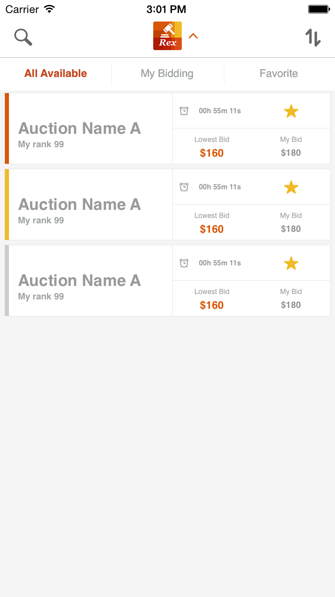

### 变更记录
| 序号 | 录入时间 | 录入人 | 备注 |
| -- | -- | -- | -- |
| 1 | 2015-03-24 | Alfred Jiang | - |

### 方案名称
UITableView / UIScrollView - 通过 contentInset 属性设置周边间距

### 方案类型（推荐 or 参考）
推荐方案

### 关键字
UIScrollView \ UITableView \ contentInset \ 边距 \ 间距

### 需求场景
1. UITableView 中第一个 cell 和最后一个 cell 距离顶部和底部距离差异

### 参考链接
1. [CocoaChina](http://www.cocoachina.com/bbs/read.php?tid=253997)

### 详细内容
设置方法如下

      self.tableView.contentInset = UIEdgeInsets(top: 8, left: 0, bottom: 8, right: 0)

未设置效果

设置后效果

### 效果图
（无）

### 备注
（无）
