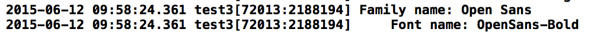

### 变更记录
| 序号 | 录入时间 | 录入人 | 备注 |
| -- | -- | -- | -- |
| 1 | 2015-06-12 | Alfred Jiang | - |

### 方案名称
字体 - 添加自定义字体

### 方案类型（推荐 or 参考）
推荐方案

### 关键字
字体 \ 自定义字体 \ 非系统字体

### 需求场景
1. 需要为 App 提供系统之外的字体时

### 参考链接
1. [CSDN - ios开发 添加自定义字体](http://blog.csdn.net/u012703795/article/details/42006093)
2. [字体下载网站一](http://font.chinaz.com/)

### 详细内容
1. 下载需要的 .ttf 格式字体,并添加入工程

2. 在 .plist 中添加如下字段

        	<key>UIAppFonts</key>
        	<array>
    		<string>OpenSans-Bold.ttf</string>
        	</array>

3. 确保 Project -> Targets -> Build Phases -> Copy Bundle Resources 中字体已加入

4. 在工程中执行下面的代码找到字体对应名称
        NSArray *familyNames = [[NSArray alloc] initWithArray:[UIFont familyNames]];
        NSArray *fontNames;
        NSInteger indFamily, indFont;
        for (indFamily=0; indFamily<[familyNames count]; ++indFamily)
        {
            NSLog(@"Family name: %@", [familyNames objectAtIndex:indFamily]);
            fontNames = [[NSArray alloc] initWithArray:
                         [UIFont fontNamesForFamilyName:
                          [familyNames objectAtIndex:indFamily]]];
            for (indFont=0; indFont<[fontNames count]; ++indFont)
            {
                NSLog(@"    Font name: %@", [fontNames objectAtIndex:indFont]);
            }
        }

5. 现在就可以像调用系统字体一样的调用添加字体了
        aLabel.font= [UIFont fontWithName:@"OpenSans-Bold" size:14];

### 效果图
（无）

### 备注
（无）
