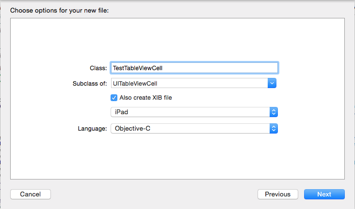

### 变更记录
| 序号 | 录入时间 | 录入人 | 备注 |
| -- | -- | -- | -- |
| 1 | 2015-08-24 | Alfred Jiang | - |

### 方案名称
Xib - 通过 Xib 加载自定义 Cell

### 方案类型（推荐 or 参考）
推荐方案

### 关键字
Xib \ UITableViewCell \ 自定义

### 需求场景
1. 需要实现较为复杂的 cell 布局，通过 xib 方式实现

### 参考链接
（无）

### 详细内容

#####1. 通过 File -> New -> File... -> iOS -> Source -> Cocoa Touch Class 创建 Cell

#####2. 在 Class 中输入自定义 Cell 名称(示例：TestTableViewCell)；在 Subclass of 中输入父类 UITableViewCell ; 勾选 Also create Xib file 选项 ； 选择平台（iPhone / iPad） 和语言（Objective-C / Swift）
 

#####3. 下面进入 TestTableViewCell.xib -> Test TableView Cell -> Utilities 面板 -> Show the Indentity inspector

#####4. 在 Restoration ID 中输入重用 ID(示例：TestTableViewCell), 这个 ID 将用于重用 cell
 

#####5. 在 ViewDidLoad 方法中向使用该 Cell 的 UITableView 注册 Xib 定义的 Cell.
    //iOS 5+
    [self.tableViewMain registerNib:[UINib nibWithNibName:NSStringFromClass([TestTableViewCell class]) bundle:nil] forCellReuseIdentifier:@"TestTableViewCell"];

    //iOS 6+ 更方便的写法
    [self.tableViewMain registerClass:[TestTableViewCell class] forCellReuseIdentifier:@"TestTableViewCell"];

#####6. 在 cellForRowAtIndexPath 方法中加载自定义 Cell

    - (UITableViewCell *)tableView:(UITableView *)tableView cellForRowAtIndexPath:(NSIndexPath *)indexPath
    {
        static NSString *aTestTableViewCell = @"TestTableViewCell";
        TestTableViewCell *cell = (TestTableViewCell*)[tableView dequeueReusableCellWithIdentifier:aTestTableViewCell];
        if (!cell)
        {
            NSArray *nib = [[NSBundle mainBundle] loadNibNamed:@"TestTableViewCell" owner:[TestTableViewCell class] options:nil];
            cell = (TestTableViewCell *)[nib objectAtIndex:0];  //这里的 0 表示 xib 中第 1 个View，也就是 Test TableView Cell
        }
        cell.selectionStyle = UITableViewCellSelectionStyleNone;
        //...
        return cell;
    }

### 效果图
（无）

### 备注
1. 尽量避免在 cell 的数据加载中进行数据运算，相关 cell 的显示依赖数据，尽量在 Model 中初始化完成， cell 直接读取显示。更多参考《[UITableView - 滑动加载性能优化总结](solutions/uitableview_-_hua_dong_jia_zai_you_hua_zong_jie.md)》
