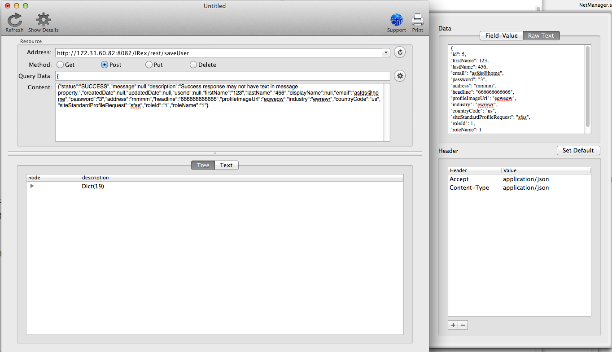

### 变更记录
| 序号 | 录入时间 | 录入人 | 备注 |
| -- | -- | -- | -- |
| 1 | 2015-03-24 | Alfred Jiang | - |

### 方案名称
使用 VisualJSON 进行 JSON 格式网络接口 API 测试

### 方案类型（推荐 or 参考）
推荐方案

### 关键字
MAC OS \ VisualJSON \ 网络请求 \ API \ POST \ GET

### 需求场景
1. 需要进行网络接口 API 测试时

### 参考链接
1. [Appstore下载地址](https://itunes.apple.com/us/app/visual-json/id488709442?mt=12)
2. [GitHub](https://github.com/youknowone/VisualJSON)

### 详细内容

#####1. 发送 GET 请求
1. 在 Address 中输入请求连接
2. 点击 Show Details 展开参数输入页
3. 在 File-Value 中输入 GET 请求参数 （亦可直接在QueryData中输入 GET 请求参数）

#####2. 发送 POST 请求
1. 在 Address 中输入请求连接
2. 点击 Show Details 展开参数输入页
3. 在 RawText 中输入 POST Json 格式请求参数

### 效果图

### 备注
另有 [VisualXML](https://itunes.apple.com/us/app/visual-xml/id617516344?mt=12)工具可以实现 XML 格式网络请求 API 测试
