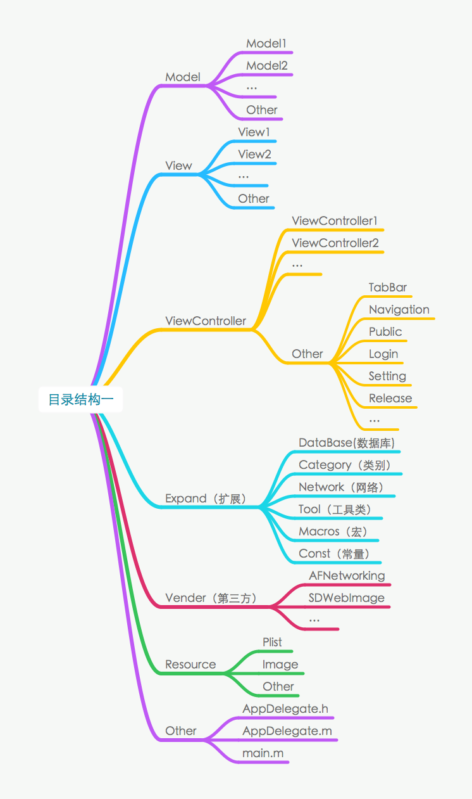
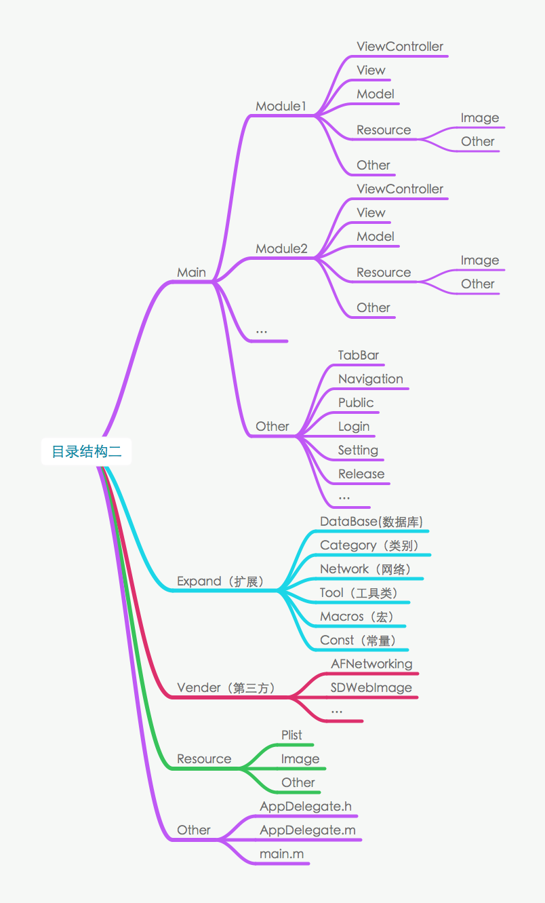

### 变更记录

| 序号 | 录入时间 | 录入人 | 备注 |
|:--------:|:--------:|:--------:|:--------:|
| 1 | 2015-08-19 | [Alfred Jiang](https://github.com/viktyz) | - |
| 2 | 2015-12-20 | [Alfred Jiang](https://github.com/viktyz) | - |

### 方案名称

文档 - iOS 项目的目录结构

### 关键字

文档 \ Xcode \ 工程 \ 目录 \ 项目目录 \ 结构

### 需求场景

1. 创建 iOS 项目工程，组织工程目录

### 参考链接

1. [CSDN - iOS 项目的目录结构能看出你的开发经验](http://blog.csdn.net/alincexiaohao/article/details/47754407)
2. [Limboy - iOS项目的目录结构和开发流程](http://limboy.me/ios/2013/09/23/build-ios-application.html)

### 详细内容

iOS 工程目录的结构根据工程规模大小大致可分为以下两类

1.主目录按照业务分类，内目录按照模块分类(主目录按照MVC架构分类，内部根据项目模块分类)

    优点：能比较快定位对应的业务。
    缺点：模块相关类太过分散，需要来回切换文件，不方便开发。

适合中小规模工程，各模块耦合度高，同时参与开发人员较少时适用

2.主目录按照模块分类，内目录按照业务分类

    优点：对某一模块用到的类集中化，方便管理与开发，对新手来说，不用来回在其他文件中切换、寻找对应的模块类。
    缺点：当几个模块公用一些类时，不太好归类。

适合较大规模工程，各模块耦合度低，同时参与开发人员较多时适用

### 效果图

### 备注

1. 建议工程目录结构对应物理文件夹结构，即目录分组则创建对应文件夹
2. 对于.h.m.xib文件或.swift.xib同名文件放在同一组，同时对应存放在同一文件夹中
3. 对于Resource中图片文件建议物理分组（文件夹分组），同时按照对应模块进行前缀命名，对于公共图片考虑存放在单独的公共文件夹中
