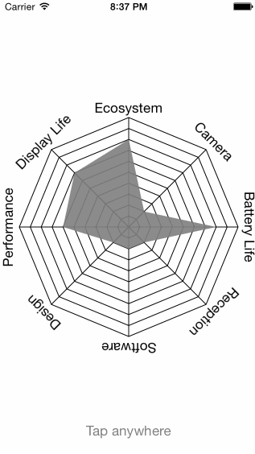

### 变更记录

| 序号 | 录入时间 | 录入人 | 备注 |
|:--------:|:--------:|:--------:|:--------:|
| 1 | 2015-03-17 | [Alfred Jiang](https://github.com/viktyz) | - |
| 2 | 2015-12-22 | [Alfred Jiang](https://github.com/viktyz) | - |

### 方案名称

特殊控件 - 雷达图（蛛网图、五行图）解决方案

### 关键字

特殊控件 \ 雷达图 \ 蛛网图 \ 五行图

### 需求场景

1. 绘制雷达图需求时

### 参考链接
(见详细内容)

### 详细内容

#####1. [GitHub - BTSpiderPlotterView](https://github.com/BTLibrary/BTSpiderPlotterView)
#####2. [GitHub - JYRadarChart](https://github.com/johnnywjy/JYRadarChart)

### 效果图

### 备注
（无）
