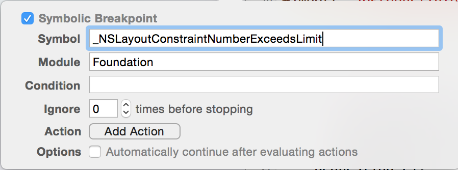

### 变更记录

| 序号 | 录入时间 | 录入人 | 备注 |
|:--------:|:--------:|:--------:|:--------:|
| 1 | 2015-03-18 | [Alfred Jiang](https://github.com/viktyz) | - |
| 2 | 2015-12-07 | [Alfred Jiang](https://github.com/viktyz) | 更新约束警告调试 |
| 3 | 2015-12-22 | [Alfred Jiang](https://github.com/viktyz) | - |
| 4 | 2016-01-04 | [Alfred Jiang](https://github.com/viktyz) | - |

### 方案名称

Xcode - 调试相关

### 关键字

Xcode \ Debug \ Crash

### 需求场景

1. 调试常见问题收集

### 参考链接

1. [Debugging iOS AutoLayout Issues](http://staxmanade.com/2015/06/debugging-ios-autolayout-issues/)
2. [博客园 - iOS 各种调试技巧豪华套餐](http://www.cnblogs.com/daiweilai/p/4421340.html)

### 详细内容

#####1. unrecognized selector sent to instance 问题快速定位的方法

方法一：在 *Debug* 菜单中选择 *Breakpoints -> Create Symbolic Breakpoint* ，在 *Symbol* 中填写如下方法签名：*-[NSObject(NSObject) doesNotRecognizeSelector:]* ，然后再运行，错误时断点会停在真正导致崩溃的地方。

方法二：添加 Exception 类断点（推荐方案）
```
打开Xcode
打开断点导航栏 cmd+7
点击左下角 **+** 号按钮
选择 Add Exception Breakpoint...
```


#####2. Swift Delegate Error show "use of undeclared type in swift project"

在 *Swift* *中，Delegate* 名称不能和函数命相同

#####3. Make a symbolic breakpoint at UIViewAlertForUnsatisfiableConstraints to catch this in the debugger.
```
打开Xcode
打开断点导航栏 cmd+7
点击左下角 **+** 号按钮
选择 Add Symbolic Breakpoint...
右键 Edit Breakpoint...
在 Symbol 中输入 UIViewAlertForUnsatisfiableConstraints
```


通过 打印内存地址信息可以查看控件信息
```
(lldb) po 0x7fc82aba1210
```

通过 recursiveDescription 方法可以查看全部页面层级关系
```
(lldb) po [[0x7fc82aba1210 superview] recursiveDescription]
```

#####4. Break on void XXXxxx() to debug.

类似以下错误提示
```
This NSLayoutConstraint is being configured with a constant that exceeds internal limits.  A smaller value will be substituted, but this problem should be fixed. Break on void _NSLayoutConstraintNumberExceedsLimit() to debug.  This will be logged only once.  This may break in the future.
```

添加断点方法

方法一：终端方式

点击暂停应用程序

在终端输入
```
(lldb) b _NSLayoutConstraintNumberExceedsLimit
Breakpoint 1: where = Foundation`_NSLayoutConstraintNumberExceedsLimit, address = 0x055e26cb
```

点击继续运行，再次进入会停在 crash 位置

方法二：添加 Xcode 断点
```
打开Xcode
打开断点导航栏 cmd+7
点击左下角 **+** 号按钮
选择 Add Symbolic Breakpoint...
右键 Edit Breakpoint...
在 Symbol 中输入 _NSLayoutConstraintNumberExceedsLimit
在 Module 中输入 Foundation
```


点击继续运行，再次进入会停在 crash 位置

#####5. viewDidLayoutSubviews 在 iOS 7 上导致应用崩溃

在 *iOS 8* 中使用 *viewDidLayoutSubviews* ，应用正常运行，没有问题，但是应用在 *iOS 7* 上运行的时候，报错，导致应用崩溃，错误信息类似：
```
Cannot find executable for CFBundle 0x78f8f220 </Library/Developer/CoreSimulator/Profiles/Runtimes/iOS 7.1.simruntime/Contents/Resources/RuntimeRoot/System/Library/AccessibilityBundles/GeoServices.axbundle

Assertion failure in -[UIView layoutSublayersOfLayerl]....unrecognizeSelector.....
```

在 *viewDidLayoutSubviews* 方法末尾添加 *[self.view layoutsubviews]* 即可解决

### 效果图
（无）

### 备注

* [Xcode - 使用 LLDB 调试代码](Note_00126_20151224.md)
* [Xcode - 运行时环境变量( Environment Variables )](Note_00140_20160205.md)
* [Auto Layout - 约束冲突断点调试方法](Note_00128_20160105.md)