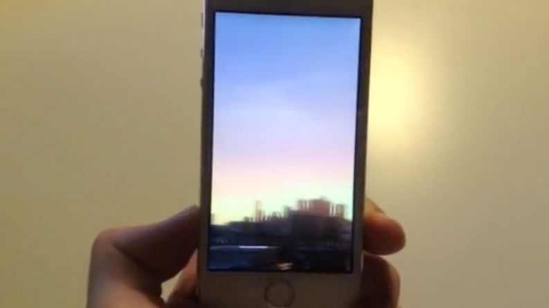

### 变更记录

| 序号 | 录入时间 | 录入人 | 备注 |
|:--------:|:--------:|:--------:|:--------:|
| 1 | 2015-03-18 | [Alfred Jiang](https://github.com/viktyz) | - |
| 2 | 2015-12-22 | [Alfred Jiang](https://github.com/viktyz) | - |

### 方案名称

特殊控件 - 使用 SubjectiveCPhotoPanner 实现动作感应显示图片

### 关键字

特殊控件 \ 动画 \ 图片显示 \ 动作

### 需求场景

1. 用于展示一些较大图片，实现较为炫酷的效果

### 参考链接

1. [Facebook Paper's tilting panner](http://subjc.com/facebook-paper-photo-panner/)
2. [GitHub - SubjectiveCPhotoPanner](https://github.com/subjc/SubjectiveCPhotoPanner)
3. [GitHub - SubjectiveCPhotoPanner_Swift](https://github.com/yichizhang/SubjectiveCPhotoPanner_Swift)

### 详细内容

#####1. SCImagePanScrollBarView.h
```objectivec
//
//  SCImagePanScrollBarView.h
//  SubjectiveCImagePan
//
//  Created by Sam Page on 16/02/14.
//  Copyright (c) 2014 Sam Page. All rights reserved.
//

#import <UIKit/UIKit.h>

@interface SCImagePanScrollBarView : UIView

- (id)initWithFrame:(CGRect)frame edgeInsets:(UIEdgeInsets)edgeInsets;
- (void)updateWithScrollAmount:(CGFloat)scrollAmount forScrollableWidth:(CGFloat)scrollableWidth inScrollableArea:(CGFloat)scrollableArea;

@end
```

#####2. SCImagePanScrollBarView.m
```objectivec
//
//  SCImagePanScrollBarView.m
//  SubjectiveCImagePan
//
//  Created by Sam Page on 16/02/14.
//  Copyright (c) 2014 Sam Page. All rights reserved.
//

#import "SCImagePanScrollBarView.h"

@interface SCImagePanScrollBarView ()
@property (nonatomic, strong) CAShapeLayer *scrollBarLayer;
@end

@implementation SCImagePanScrollBarView

- (id)initWithFrame:(CGRect)frame edgeInsets:(UIEdgeInsets)edgeInsets;
{
    if (self = [super initWithFrame:frame])
    {
        UIBezierPath *scrollBarPath = [UIBezierPath bezierPath];
        [scrollBarPath moveToPoint:CGPointMake(edgeInsets.left, CGRectGetHeight(self.bounds) - edgeInsets.bottom)];
        [scrollBarPath addLineToPoint:CGPointMake(CGRectGetWidth(self.bounds) - edgeInsets.right, CGRectGetHeight(self.bounds) - edgeInsets.bottom)];

        CAShapeLayer *scrollBarBackgroundLayer = [CAShapeLayer layer];
        scrollBarBackgroundLayer.path = scrollBarPath.CGPath;
        scrollBarBackgroundLayer.lineWidth = 1.f;
        scrollBarBackgroundLayer.strokeColor = [[[UIColor whiteColor] colorWithAlphaComponent:0.1] CGColor];
        scrollBarBackgroundLayer.fillColor = [[UIColor clearColor] CGColor];

        [self.layer addSublayer:scrollBarBackgroundLayer];

        self.scrollBarLayer = [CAShapeLayer layer];
        self.scrollBarLayer.path = scrollBarPath.CGPath;
        self.scrollBarLayer.lineWidth = 1.f;
        self.scrollBarLayer.strokeColor = [[UIColor whiteColor] CGColor];
        self.scrollBarLayer.fillColor = [[UIColor clearColor] CGColor];
        self.scrollBarLayer.actions = @{@"strokeStart": [NSNull null], @"strokeEnd": [NSNull null]};

        [self.layer addSublayer:self.scrollBarLayer];
    }
    return self;
}

- (void)updateWithScrollAmount:(CGFloat)scrollAmount forScrollableWidth:(CGFloat)scrollableWidth inScrollableArea:(CGFloat)scrollableArea
{
    self.scrollBarLayer.strokeStart = scrollAmount * scrollableArea;
    self.scrollBarLayer.strokeEnd = (scrollAmount * scrollableArea) + scrollableWidth;
}

@end
```

#####3. SCImagePanViewController.h
```objectivec
//
//  SCImagePanViewController.h
//  SubjectiveCImagePan
//
//  Created by Sam Page on 16/02/14.
//  Copyright (c) 2014 Sam Page. All rights reserved.
//

#import <UIKit/UIKit.h>
#import <CoreMotion/CoreMotion.h>

@interface SCImagePanViewController : UIViewController

- (id)initWithMotionManager:(CMMotionManager *)motionManager;
- (void)configureWithImage:(UIImage *)image;

@end
```

#####4. SCImagePanViewController.m
```objectivec
//
//  SCImagePanViewController.m
//  SubjectiveCImagePan
//
//  Created by Sam Page on 16/02/14.
//  Copyright (c) 2014 Sam Page. All rights reserved.
//

#import "SCImagePanViewController.h"
#import "SCImagePanScrollBarView.h"

@interface SCImagePanViewController () <UIScrollViewDelegate>

@property (nonatomic, strong) CMMotionManager *motionManager;
@property (nonatomic, strong) CADisplayLink *displayLink;

@property (nonatomic, strong) UIScrollView *panningScrollView;
@property (nonatomic, strong) UIImageView *panningImageView;
@property (nonatomic, strong) SCImagePanScrollBarView *scrollBarView;

@property (nonatomic, assign, getter = isMotionBasedPanEnabled) BOOL motionBasedPanEnabled;

@end

static CGFloat kMovementSmoothing = 0.3f;
static CGFloat kAnimationDuration = 0.3f;
static CGFloat kRotationMultiplier = 5.f;

@implementation SCImagePanViewController

#pragma mark - init / dealloc

- (id)initWithMotionManager:(CMMotionManager *)motionManager
{
    if (self = [super initWithNibName:nil bundle:nil])
    {
        self.motionManager = motionManager;
        self.motionBasedPanEnabled = YES;
    }
    return self;
}

- (void)dealloc
{
    [_displayLink invalidate];
    [_motionManager stopDeviceMotionUpdates];
}

#pragma mark - View Lifecycle

- (void)viewDidLoad
{
    [super viewDidLoad];

    self.panningScrollView = [[UIScrollView alloc] initWithFrame:self.view.bounds];
    self.panningScrollView.autoresizingMask = UIViewAutoresizingFlexibleWidth|UIViewAutoresizingFlexibleHeight;
    self.panningScrollView.backgroundColor = [UIColor blackColor];
    self.panningScrollView.delegate = self;
    self.panningScrollView.scrollEnabled = NO;
    self.panningScrollView.alwaysBounceVertical = NO;
    self.panningScrollView.maximumZoomScale = 2.f;
    [self.panningScrollView.pinchGestureRecognizer addTarget:self action:@selector(pinchGestureRecognized:)];

    [self.view addSubview:self.panningScrollView];

    self.panningImageView = [[UIImageView alloc] initWithFrame:self.view.bounds];
    self.panningImageView.autoresizingMask = UIViewAutoresizingFlexibleWidth|UIViewAutoresizingFlexibleHeight;
    self.panningImageView.backgroundColor = [UIColor blackColor];
    self.panningImageView.contentMode = UIViewContentModeScaleAspectFit;

    [self.panningScrollView addSubview:self.panningImageView];

    self.scrollBarView = [[SCImagePanScrollBarView alloc] initWithFrame:self.view.bounds edgeInsets:UIEdgeInsetsMake(0.f, 10.f, 50.f, 10.f)];
    self.scrollBarView.autoresizingMask = UIViewAutoresizingFlexibleWidth|UIViewAutoresizingFlexibleHeight;
    self.scrollBarView.userInteractionEnabled = NO;
    [self.view addSubview:self.scrollBarView];

    self.displayLink = [CADisplayLink displayLinkWithTarget:self selector:@selector(displayLinkUpdate:)];
    [self.displayLink addToRunLoop:[NSRunLoop mainRunLoop] forMode:NSRunLoopCommonModes];

    UITapGestureRecognizer *tapGestureRecognizer = [[UITapGestureRecognizer alloc] initWithTarget:self action:@selector(toggleMotionBasedPan:)];
    [self.view addGestureRecognizer:tapGestureRecognizer];
}

- (void)viewDidAppear:(BOOL)animated
{
    [super viewDidAppear:animated];

    self.panningScrollView.contentOffset = CGPointMake((self.panningScrollView.contentSize.width / 2.f) - (CGRectGetWidth(self.panningScrollView.bounds)) / 2.f,
                                                       (self.panningScrollView.contentSize.height / 2.f) - (CGRectGetHeight(self.panningScrollView.bounds)) / 2.f);

    [self.motionManager startDeviceMotionUpdatesToQueue:[NSOperationQueue mainQueue] withHandler:^(CMDeviceMotion *motion, NSError *error) {
        [self calculateRotationBasedOnDeviceMotionRotationRate:motion];
    }];
}

#pragma mark - Status Bar

- (BOOL)prefersStatusBarHidden
{
    return YES;
}

#pragma mark - Public

- (void)configureWithImage:(UIImage *)image
{
    self.panningImageView.image = image;
    [self updateScrollViewZoomToMaximumForImage:image];
}

#pragma mark - Motion Handling

- (void)calculateRotationBasedOnDeviceMotionRotationRate:(CMDeviceMotion *)motion
{
    if (self.isMotionBasedPanEnabled)
    {
        CGFloat xRotationRate = motion.rotationRate.x;
        CGFloat yRotationRate = motion.rotationRate.y;
        CGFloat zRotationRate = motion.rotationRate.z;

        if (fabs(yRotationRate) > (fabs(xRotationRate) + fabs(zRotationRate)))
        {
            CGFloat invertedYRotationRate = yRotationRate * -1;

            CGFloat zoomScale = [self maximumZoomScaleForImage:self.panningImageView.image];
            CGFloat interpretedXOffset = self.panningScrollView.contentOffset.x + (invertedYRotationRate * zoomScale * kRotationMultiplier);

            CGPoint contentOffset = [self clampedContentOffsetForHorizontalOffset:interpretedXOffset];

            [UIView animateWithDuration:kMovementSmoothing
                                  delay:0.0f
                                options:UIViewAnimationOptionBeginFromCurrentState|UIViewAnimationOptionAllowUserInteraction|UIViewAnimationOptionCurveEaseOut
                             animations:^{
                                 [self.panningScrollView setContentOffset:contentOffset animated:NO];
                             } completion:NULL];
        }
    }
}

#pragma mark - CADisplayLink

- (void)displayLinkUpdate:(CADisplayLink *)displayLink
{
    CALayer *panningImageViewPresentationLayer = self.panningImageView.layer.presentationLayer;
    CALayer *panningScrollViewPresentationLayer = self.panningScrollView.layer.presentationLayer;

    CGFloat horizontalContentOffset = CGRectGetMinX(panningScrollViewPresentationLayer.bounds);

    CGFloat contentWidth = CGRectGetWidth(panningImageViewPresentationLayer.frame);
    CGFloat visibleWidth = CGRectGetWidth(self.panningScrollView.bounds);

    CGFloat clampedXOffsetAsPercentage = fmax(0.f, fmin(1.f, horizontalContentOffset / (contentWidth - visibleWidth)));

    CGFloat scrollBarWidthPercentage = visibleWidth / contentWidth;
    CGFloat scrollableAreaPercentage = 1.0 - scrollBarWidthPercentage;

    [self.scrollBarView updateWithScrollAmount:clampedXOffsetAsPercentage forScrollableWidth:scrollBarWidthPercentage inScrollableArea:scrollableAreaPercentage];
}

#pragma mark - Zoom toggling

- (void)toggleMotionBasedPan:(id)sender
{
    BOOL motionBasedPanWasEnabled = self.isMotionBasedPanEnabled;
    if (motionBasedPanWasEnabled)
    {
        self.motionBasedPanEnabled = NO;
    }

    [UIView animateWithDuration:kAnimationDuration
                     animations:^{
                         [self updateViewsForMotionBasedPanEnabled:!motionBasedPanWasEnabled];
                     } completion:^(BOOL finished) {
                         if (motionBasedPanWasEnabled == NO)
                         {
                             self.motionBasedPanEnabled = YES;
                         }
                     }];
}

- (void)updateViewsForMotionBasedPanEnabled:(BOOL)motionBasedPanEnabled
{
    if (motionBasedPanEnabled)
    {
        [self updateScrollViewZoomToMaximumForImage:self.panningImageView.image];
        self.panningScrollView.scrollEnabled = NO;
    }
    else
    {
        self.panningScrollView.zoomScale = 1.f;
        self.panningScrollView.scrollEnabled = YES;
    }
}

#pragma mark - Zooming

- (CGFloat)maximumZoomScaleForImage:(UIImage *)image
{
    return (CGRectGetHeight(self.panningScrollView.bounds) / CGRectGetWidth(self.panningScrollView.bounds)) * (image.size.width / image.size.height);
}

- (void)updateScrollViewZoomToMaximumForImage:(UIImage *)image
{
    CGFloat zoomScale = [self maximumZoomScaleForImage:image];

    self.panningScrollView.maximumZoomScale = zoomScale;
    self.panningScrollView.zoomScale = zoomScale;
}

#pragma mark - Helpers

- (CGPoint)clampedContentOffsetForHorizontalOffset:(CGFloat)horizontalOffset;
{
    CGFloat maximumXOffset = self.panningScrollView.contentSize.width - CGRectGetWidth(self.panningScrollView.bounds);
    CGFloat minimumXOffset = 0.f;

    CGFloat clampedXOffset = fmaxf(minimumXOffset, fmin(horizontalOffset, maximumXOffset));
    CGFloat centeredY = (self.panningScrollView.contentSize.height / 2.f) - (CGRectGetHeight(self.panningScrollView.bounds)) / 2.f;

    return CGPointMake(clampedXOffset, centeredY);
}

#pragma mark - Pinch gesture

- (void)pinchGestureRecognized:(id)sender
{
    self.motionBasedPanEnabled = NO;
    self.panningScrollView.scrollEnabled = YES;
}

#pragma mark - UIScrollViewDelegate

- (UIView *)viewForZoomingInScrollView:(UIScrollView *)scrollView
{
    return self.panningImageView;
}

- (void)scrollViewDidEndZooming:(UIScrollView *)scrollView withView:(UIView *)view atScale:(CGFloat)scale
{
    [scrollView setContentOffset:[self clampedContentOffsetForHorizontalOffset:scrollView.contentOffset.x] animated:YES];
}

- (void)scrollViewDidEndDragging:(UIScrollView *)scrollView willDecelerate:(BOOL)decelerate
{
    if (decelerate == NO)
    {
        [scrollView setContentOffset:[self clampedContentOffsetForHorizontalOffset:scrollView.contentOffset.x] animated:YES];
    }
}

- (void)scrollViewWillBeginDecelerating:(UIScrollView *)scrollView
{
    [scrollView setContentOffset:[self clampedContentOffsetForHorizontalOffset:scrollView.contentOffset.x] animated:YES];
}

@end
```

#####5. 用法
```objectivec
CMMotionManager *motionManager = [[CMMotionManager alloc] init];
self.imagePanViewController = [[SCImagePanViewController alloc] initWithMotionManager:motionManager];

[self.imagePanViewController willMoveToParentViewController:self];

[self addChildViewController:self.imagePanViewController];
[self.view addSubview:self.imagePanViewController.view];

self.imagePanViewController.view.frame = self.view.bounds;
self.imagePanViewController.view.autoresizingMask = UIViewAutoresizingFlexibleWidth|UIViewAutoresizingFlexibleHeight;

[self.imagePanViewController didMoveToParentViewController:self];

UIImage *panoramaImage = [UIImage imageNamed:@"melbourne.jpg"];
[self.imagePanViewController configureWithImage:panoramaImage];
```

### 效果图


### 备注
（无）