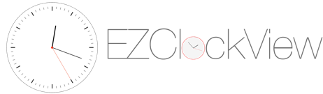
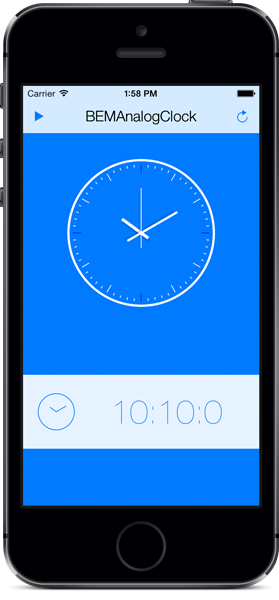

### 变更记录

| 序号 | 录入时间 | 录入人 | 备注 |
|:--------:|:--------:|:--------:|:--------:|
| 1 | 2015-03-26 | [Alfred Jiang](https://github.com/viktyz) | - |
| 2 | 2015-12-23 | [Alfred Jiang](https://github.com/viktyz) | - |

### 方案名称

特殊控件 - 钟表效果实现

### 关键字

特殊控件 \ 时间 \ 表盘 \ 钟面 \ 时钟

### 需求场景

1. 需要时钟效果的页面

### 参考链接

1. [Code4app - Clock View](http://code4app.com/ios/Clock-View/4f9ab76d06f6e7511c000000)
2. [GitHub - BEMAnalogClock](https://github.com/Boris-Em/BEMAnalogClock)
3. [GitHub - EZClockView](https://github.com/notbenoit/EZClockView)

### 详细内容

#####1. Swift 版本 EZClockView



静态表盘，需要使用类似倒计时器来不断刷新赋值
```swift
// Copyright (c) 2015 Benoit Layer
//
// Permission is hereby granted, free of charge, to any person obtaining a copy
// of this software and associated documentation files (the "Software"), to deal
// in the Software without restriction, including without limitation the rights
// to use, copy, modify, merge, publish, distribute, sublicense, and/or sell
// copies of the Software, and to permit persons to whom the Software is
// furnished to do so, subject to the following conditions:
//
// The above copyright notice and this permission notice shall be included in
// all copies or substantial portions of the Software.
//
// THE SOFTWARE IS PROVIDED "AS IS", WITHOUT WARRANTY OF ANY KIND, EXPRESS OR
// IMPLIED, INCLUDING BUT NOT LIMITED TO THE WARRANTIES OF MERCHANTABILITY,
// FITNESS FOR A PARTICULAR PURPOSE AND NONINFRINGEMENT. IN NO EVENT SHALL THE
// AUTHORS OR COPYRIGHT HOLDERS BE LIABLE FOR ANY CLAIM, DAMAGES OR OTHER
// LIABILITY, WHETHER IN AN ACTION OF CONTRACT, TORT OR OTHERWISE, ARISING FROM,
// OUT OF OR IN CONNECTION WITH THE SOFTWARE OR THE USE OR OTHER DEALINGS IN
// THE SOFTWARE.

import UIKit

@IBDesignable
public class EZClockView: UIView {

    // MARK: - Properties
    private var faceView: UIView = UIView()
    private var centerView: UIView = UIView()
    private var handHours: UIView = UIView()
    private var handMinutes: UIView = UIView()
    private var handSeconds: UIView = UIView()

    private var hourProperty: Int = 0
    private var minuteProperty: Int = 0
    private var secondProperty: Int = 0

    // MARK: animation
    /// Set the animation duration (the view is animated when calling the setTime methods)
    public var animationDuration: NSTimeInterval = 0.3

    // MARK: Time
    /// Set this property to change the hour hand position.
    @IBInspectable public var hours: Int {
        get {
            return hourProperty
        }
        set {
            hourProperty = newValue
            updateHands()
        }
    }
    /// Set this property to change the minutes hand position.
    @IBInspectable public var minutes: Int {
        get {
            return minuteProperty
        }
        set {
            minuteProperty = newValue
            updateHands()
        }
    }
    /// Set this property to change the seconds hand position.
    @IBInspectable public var seconds: Int {
        get {
            return secondProperty
        }
        set {
            secondProperty = newValue
            updateHands()
        }
    }

    // MARK: Face
    /// Defines the background color of the face. Defaults to white.
    @IBInspectable public var faceBackgroundColor: UIColor = UIColor.whiteColor() { didSet { faceView.backgroundColor = faceBackgroundColor } }
    /// Defines the border color of the face. Defaults to black.
    @IBInspectable public var faceBorderColor: UIColor = UIColor.blackColor()
    /// Defines the border width of the face. Defaults to 2.
    @IBInspectable public var faceBorderWidth: CGFloat = 2.0

    // MARK: Center disc
    /// Defines the color of the rounded part in the middle of the face, over the needles. Default is red.
    @IBInspectable public var centerColor: UIColor = UIColor.redColor() { didSet { centerView.backgroundColor = centerColor } }
    /// Desfines the width of the center circle. Default is 3.0.
    @IBInspectable public var centerRadius: CGFloat = 3.0 { didSet { setupCenterView() } }
    /// Defines the width for the border of this center part. Default is 1.0.
    @IBInspectable public var centerBorderWidth: CGFloat = 1.0 { didSet { centerView.layer.borderWidth = centerBorderWidth } }
    /// Defines the color for the border of this center part. Default is red.
    @IBInspectable public var centerBorderColor: UIColor = UIColor.redColor() { didSet { centerView.layer.borderColor = centerBorderColor.CGColor } }

    // MARK: Hour hand
    /// Defines the color for the hours hand. Default to black.
    @IBInspectable public var hoursColor: UIColor = UIColor.blackColor() { didSet { handHours.backgroundColor = hoursColor } }
    /// Defines the length of the hours hand. It is represented as a ratio of the radius of the face. Default to 0.5.
    @IBInspectable public var hoursLength: CGFloat = 0.5 {
        didSet { setupHand(handHours, lengthRatio: hoursLength, thickness: hoursThickness, offset: hoursOffset) }
    }
    /// Defines the thickness of the hours hand. Default is 4.
    @IBInspectable public var hoursThickness: CGFloat = 4 {
        didSet { setupHand(handHours, lengthRatio: hoursLength, thickness: hoursThickness, offset: hoursOffset) }
    }
    /// Defines the distance by which the hours hand will overlap over the center of the face. Default is 2.
    @IBInspectable public var hoursOffset: CGFloat = 2 {
        didSet { setupHand(handHours, lengthRatio: hoursLength, thickness: hoursThickness, offset: hoursOffset) }
    }

    // MARK: Minute hand
    /// Defines the color for the minutes hand. Default to black.
    @IBInspectable public var minutesColor: UIColor = UIColor.blackColor() { didSet { handMinutes.backgroundColor = minutesColor } }
    /// Defines the length of the minutes hand. It is represented as a ratio of the radius of the face. Default to 0.7.
    @IBInspectable public var minutesLength: CGFloat = 0.7 {
        didSet { setupHand(handMinutes, lengthRatio: minutesLength, thickness: minutesThickness, offset: minutesOffset) }
    }
    /// Defines the thickness of the minutes hand. Default is 2.
    @IBInspectable public var minutesThickness: CGFloat = 2 {
        didSet { setupHand(handMinutes, lengthRatio: minutesLength, thickness: minutesThickness, offset: minutesOffset) }
    }
    /// Defines the distance by which the minutes hand will overlap over the center of the face. Default is 2.
    @IBInspectable public var minutesOffset: CGFloat = 2 {
        didSet { setupHand(handMinutes, lengthRatio: minutesLength, thickness: minutesThickness, offset: minutesOffset) }
    }

    // MARK: Second hand
    /// Defines the color for the seconds hand. Default to red.
    @IBInspectable public var secondsColor: UIColor = UIColor.redColor() { didSet { handSeconds.backgroundColor = secondsColor } }
    /// Defines the length of the seconds hand. It is represented as a ratio of the radius of the face. Default to 0.8.
    @IBInspectable public var secondsLength: CGFloat = 0.8 {
        didSet { setupHand(handSeconds, lengthRatio: secondsLength, thickness: secondsThickness, offset: secondsOffset) }
    }
    /// Defines the thickness of the seconds hand. Default is 1.
    @IBInspectable public var secondsThickness: CGFloat = 1 {
        didSet { setupHand(handSeconds, lengthRatio: secondsLength, thickness: secondsThickness, offset: secondsOffset) }
    }
    /// Defines the distance by which the seconds hand will overlap over the center of the face. Default is 2.
    @IBInspectable public var secondsOffset: CGFloat = 2 {
        didSet { setupHand(handSeconds, lengthRatio: secondsLength, thickness: secondsThickness, offset: secondsOffset) }
    }

    // MARK: - Public methods
    /**
    Set the time the clock will display. You can animate it or not.

    :param: h The hour to set
    :param: m The minute to set
    :param: s The second to set
    :param: animated Whether or not the change should be animated (default to false).
    */
    public func setTime(#h: Int, m: Int, s: Int, animated: Bool = false) {
        hourProperty = h
        minuteProperty = m
        secondProperty = s
        updateHands(animated: animated)
    }

    /**
    Set the time the clock will display directly by using an NSDate instance.

    :param: date The date to display. Only hours, minutes, and seconds, will be taken into account.
    :param: animated Whether or not the change should be animated (default to false).
    */
    public func setTime(date: NSDate, animated: Bool = false) {
        let components = NSCalendar.currentCalendar().components((.HourCalendarUnit | .MinuteCalendarUnit | .SecondCalendarUnit), fromDate: date)
        hourProperty = components.hour
        minuteProperty = components.minute
        secondProperty = components.second
        updateHands(animated: animated)
    }

    public override func layoutSubviews() {
        super.layoutSubviews()

        let clockRadius = min(self.bounds.size.width, self.bounds.size.height)

        // Reset all transforms
        setupHand(handHours, lengthRatio: hoursLength, thickness: hoursThickness, offset: hoursOffset)
        setupHand(handMinutes, lengthRatio: minutesLength, thickness: minutesThickness, offset: minutesOffset)
        setupHand(handSeconds, lengthRatio: secondsLength, thickness: secondsThickness, offset: secondsOffset)

        setupCenterView()

        handHours.backgroundColor = hoursColor
        handMinutes.backgroundColor = minutesColor
        handSeconds.backgroundColor = secondsColor

        faceView.frame.size = CGSize(width: clockRadius, height: clockRadius)
        faceView.center = CGPointMake(CGRectGetMidX(self.bounds), CGRectGetMidY(self.bounds))
        faceView.layer.cornerRadius = clockRadius/2.0
        faceView.backgroundColor = faceBackgroundColor
        faceView.layer.borderWidth = faceBorderWidth
        faceView.layer.borderColor = faceBorderColor.CGColor


        setTime(h: hours, m: minutes, s: seconds)
    }

    public override func willMoveToSuperview(newSuperview: UIView?) {
        if (faceView.superview == nil) {

            self.backgroundColor = UIColor.clearColor()

            self.addSubview(faceView)
            self.addSubview(handHours)
            self.addSubview(handMinutes)
            self.addSubview(handSeconds)
            self.addSubview(centerView)
        }
    }

    // MARK: - Private methods
    private func setupHand(hand: UIView, lengthRatio: CGFloat, thickness: CGFloat, offset: CGFloat) {
        hand.transform = CGAffineTransformIdentity
        hand.layer.allowsEdgeAntialiasing = true

        let clockRadius = min(self.bounds.size.width, self.bounds.size.height)
        let handLength = (clockRadius/2.0) * CGFloat(lengthRatio)

        let anchorX: CGFloat = 0.5
        let anchorY: CGFloat = 1.0 - (offset/handLength)
        hand.layer.anchorPoint = CGPoint(x: anchorX, y: anchorY)

        let centerInParent = CGPointMake(CGRectGetMidX(self.bounds), CGRectGetMidY(self.bounds))
        hand.frame = CGRectMake(centerInParent.x-(thickness/2), centerInParent.y - handLength + offset, thickness, handLength)

        // Replace the hand at appropriate position
        updateHands()
    }

    private func setupCenterView() {
        centerView.bounds = CGRect(origin: CGPointZero, size: CGSize(width: centerRadius*2, height: centerRadius*2))
        centerView.center = CGPointMake(CGRectGetMidX(self.bounds), CGRectGetMidY(self.bounds))
        centerView.layer.cornerRadius = centerRadius
        centerView.backgroundColor = centerColor
        centerView.layer.borderColor = centerBorderColor.CGColor
        centerView.layer.borderWidth = centerBorderWidth
    }

    private func updateHands(animated: Bool = false) {
        // Put everything in seconds to have ratios
        let hoursInSeconds = (hours%12)*3600
        let minutesInSeconds = (minutes%60)*60
        let secondsInSeconds = (seconds%60)

        let hoursRatio = CGFloat(hoursInSeconds + minutesInSeconds + secondsInSeconds) / 43200.0
        let minutesRatio = CGFloat(minutesInSeconds + secondsInSeconds) / 3600.0
        let secondsRatio = CGFloat(secondsInSeconds) / 60.0

        if (animated) {
            UIView.animateWithDuration(animationDuration) {
                self.handSeconds.transform = CGAffineTransformMakeRotation(CGFloat(2*M_PI)*secondsRatio)
                self.handMinutes.transform = CGAffineTransformMakeRotation(CGFloat(2*M_PI)*minutesRatio)
                self.handHours.transform = CGAffineTransformMakeRotation(CGFloat(2*M_PI)*hoursRatio)
            }
        } else {
            handSeconds.transform = CGAffineTransformMakeRotation(CGFloat(2*M_PI)*secondsRatio)
            handMinutes.transform = CGAffineTransformMakeRotation(CGFloat(2*M_PI)*minutesRatio)
            handHours.transform = CGAffineTransformMakeRotation(CGFloat(2*M_PI)*hoursRatio)
        }
    }
}
```

#####2. Objective-C 版本 Clock View

动态表盘，较早版本，MRC编写，需要设置 -fno-objc-arc

1. ClockView.h
```objectivec
//
//
//  clock
//
//  Created by Ignacio Enriquez Gutierrez on 1/31/11.
//  Copyright 2011 Nacho4D. All rights reserved.
//  See the file License.txt for copying permission.
//

#import <UIKit/UIKit.h>
#import <QuartzCore/QuartzCore.h>

@interface ClockView : UIView {

    CALayer *containerLayer;
    CALayer *hourHand;
    CALayer *minHand;
    CALayer *secHand;
    NSTimer *timer;

}

//basic methods
- (void)start;
- (void)stop;

//customize appearence
- (void)setHourHandImage:(CGImageRef)image;
- (void)setMinHandImage:(CGImageRef)image;
- (void)setSecHandImage:(CGImageRef)image;
- (void)setClockBackgroundImage:(CGImageRef)image;

//to customize hands size: adjust following values in .m file
//HOURS_HAND_LENGTH
//MIN_HAND_LENGTH
//SEC_HAND_LENGTH
//HOURS_HAND_WIDTH
//MIN_HAND_WIDTH
//SEC_HAND_WIDTH

@end
```

2. ClockView.m
```objectivec
//
//  ClockView.m
//  clock
//
//  Created by Ignacio Enriquez Gutierrez on 1/31/11.
//  Copyright 2011 Nacho4D. All rights reserved.
//  See the file License.txt for copying permission.
//

#import "ClockView.h"

@implementation ClockView

#pragma mark - Public Methods

- (void)start
{
    timer = [NSTimer scheduledTimerWithTimeInterval:1.0 target:self selector:@selector(updateClock:) userInfo:nil repeats:YES];
}

- (void)stop
{
    [timer invalidate];
    timer = nil;
}

//customize appearence
- (void)setHourHandImage:(CGImageRef)image
{
    if (image == NULL) {
        hourHand.backgroundColor = [UIColor grayColor].CGColor;
        hourHand.cornerRadius = 3;
    }else{
        hourHand.backgroundColor = [UIColor clearColor].CGColor;
        hourHand.cornerRadius = 0.0;

    }
    hourHand.contents = (id)image;
}

- (void)setMinHandImage:(CGImageRef)image
{
    if (image == NULL) {
        minHand.backgroundColor = [UIColor grayColor].CGColor;
    }else{
        minHand.backgroundColor = [UIColor clearColor].CGColor;
    }
    minHand.contents = (id)image;
}

- (void)setSecHandImage:(CGImageRef)image
{
    if (image == NULL) {
        secHand.backgroundColor = [UIColor whiteColor].CGColor;
        secHand.borderWidth = 1.0;
        secHand.borderColor = [UIColor redColor].CGColor;
    }else{
        secHand.backgroundColor = [UIColor clearColor].CGColor;
        secHand.borderWidth = 0.0;
        secHand.borderColor = [UIColor clearColor].CGColor;
    }
    secHand.contents = (id)image;
}

- (void)setClockBackgroundImage:(CGImageRef)image
{
    if (image == NULL) {
        containerLayer.borderColor = [UIColor blackColor].CGColor;
        containerLayer.borderWidth = 1.0;
        containerLayer.cornerRadius = 5.0;
    }else{
        containerLayer.borderColor = [UIColor clearColor].CGColor;
        containerLayer.borderWidth = 0.0;
        containerLayer.cornerRadius = 0.0;
    }
    containerLayer.contents = (id)image;
}

#pragma mark - Private Methods

//Default sizes of hands:
//in percentage (0.0 - 1.0)
#define HOURS_HAND_LENGTH 0.65
#define MIN_HAND_LENGTH 0.75
#define SEC_HAND_LENGTH 0.8
//in pixels
#define HOURS_HAND_WIDTH 1
#define MIN_HAND_WIDTH 1
#define SEC_HAND_WIDTH 1

float Degrees2Radians(float degrees) { return degrees * M_PI / 180; }

//timer callback
- (void) updateClock:(NSTimer *)theTimer{

    NSDateComponents *dateComponents = [[NSCalendar currentCalendar] components:(NSCalendarUnitHour | NSCalendarUnitMinute | NSCalendarUnitSecond) fromDate:[NSDate date]];
    NSInteger seconds = [dateComponents second];
    NSInteger minutes = [dateComponents minute];
    NSInteger hours = [dateComponents hour];
    //NSLog(@"raw: hours:%d min:%d secs:%d", hours, minutes, seconds);
    if (hours > 12) hours -=12; //PM

    //set angles for each of the hands
    CGFloat secAngle = Degrees2Radians(seconds/60.0*360);
    CGFloat minAngle = Degrees2Radians(minutes/60.0*360);
    CGFloat hourAngle = Degrees2Radians(hours/12.0*360) + minAngle/12.0;

    //reflect the rotations + 180 degres since CALayers coordinate system is inverted
    secHand.transform = CATransform3DMakeRotation (secAngle+M_PI, 0, 0, 1);
    minHand.transform = CATransform3DMakeRotation (minAngle+M_PI, 0, 0, 1);
    hourHand.transform = CATransform3DMakeRotation (hourAngle+M_PI, 0, 0, 1);
}

#pragma mark - Overrides

- (void) layoutSubviews
{
    [super layoutSubviews];

    containerLayer.frame = CGRectMake(0, 0, self.frame.size.width, self.frame.size.height);

    float length = MIN(self.frame.size.width, self.frame.size.height)/2;
    CGPoint c = CGPointMake(self.frame.size.width/2, self.frame.size.height/2);
    hourHand.position = minHand.position = secHand.position = c;

    CGFloat w, h;

    if (hourHand.contents == NULL){
        w = HOURS_HAND_WIDTH;
        h = length*HOURS_HAND_LENGTH;
    }else{
        w = CGImageGetWidth((CGImageRef)hourHand.contents);
        h = CGImageGetHeight((CGImageRef)hourHand.contents);
    }
    hourHand.bounds = CGRectMake(0,0,w,h);

    if (minHand.contents == NULL){
        w = MIN_HAND_WIDTH;
        h = length*MIN_HAND_LENGTH;
    }else{
        w = CGImageGetWidth((CGImageRef)minHand.contents);
        h = CGImageGetHeight((CGImageRef)minHand.contents);
    }
    minHand.bounds = CGRectMake(0,0,w,h);

    if (secHand.contents == NULL){
        w = SEC_HAND_WIDTH;
        h = length*SEC_HAND_LENGTH;
    }else{
        w = CGImageGetWidth((CGImageRef)secHand.contents);
        h = CGImageGetHeight((CGImageRef)secHand.contents);
    }
    secHand.bounds = CGRectMake(0,0,w,h);

    hourHand.anchorPoint = CGPointMake(0.5,0.0);
    minHand.anchorPoint = CGPointMake(0.5,0.0);
    secHand.anchorPoint = CGPointMake(0.5,0.0);
    containerLayer.anchorPoint = CGPointMake(0.5, 0.5);
}

- (id)initWithFrame:(CGRect)frame
{
    self = [super initWithFrame:frame];
    if (self) {

        containerLayer = [[CALayer layer] retain];
        hourHand = [[CALayer layer] retain];
        minHand = [[CALayer layer] retain];
        secHand = [[CALayer layer] retain];

        //default appearance
        [self setClockBackgroundImage:NULL];
        [self setHourHandImage:NULL];
        [self setMinHandImage:NULL];
        [self setSecHandImage:NULL];

        //add all created sublayers
        [containerLayer addSublayer:hourHand];
        [containerLayer addSublayer:minHand];
        [containerLayer addSublayer:secHand];
        [self.layer addSublayer:containerLayer];
    }
    return self;
}

- (void)dealloc
{
    [self stop];
    [hourHand release];
    [minHand release];
    [secHand release];
    [containerLayer release];

    [super dealloc];
}

@end
```

#####3. Objective-C 版本 [BEMAnalogClock](https://github.com/Boris-Em/BEMAnalogClock)



功能较为完善版本，可以手动拨动指针实现动态修改时间,如果需要实现较为复杂的时钟可考虑使用该版本

### 效果图
（无）

### 备注
（无）