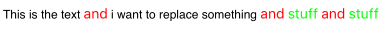

### 变更记录

| 序号 | 录入时间 | 录入人 | 备注 |
|:--------:|:--------:|:--------:|:--------:|
| 1 | 2015-04-13 | [Alfred Jiang](https://github.com/viktyz) | - |
| 2 | 2015-08-28 | [Alfred Jiang](https://github.com/viktyz) | - |
| 3 | 2015-12-23 | [Alfred Jiang](https://github.com/viktyz) | - |
| 3 | 2016-05-03 | [Alfred Jiang](https://github.com/viktyz) | 增加 批量替换子字符串显示格式 |

### 方案名称

UILabel - 显示多格式文本

### 关键字

UILabel \ NSMutableAttributedString \ attributedText \ 批量替换

### 需求场景

1. 需要显示一段多格式的文本
2. 批量替换子字符串显示格式

### 参考链接
1. [Stack Overflow - Change attributes of substrings in a NSAttributedString](http://stackoverflow.com/questions/17486647/change-attributes-of-substrings-in-a-nsattributedstring)

### 详细内容

#### 1. Objective-C 示例

##### 显示富文本格式

```objectivec
NSString *plainText = [NSString stringWithFormat:@"%@ test", @"click"];
NSMutableAttributedString *styleText = [[NSMutableAttributedString alloc] initWithString:plainText];
NSDictionary *attr = @{NSFontAttributeName: [UIFont systemFontOfSize:15],NSForegroundColorAttributeName : [UIColor redColor]};
NSRange nameRange = [plainText rangeOfString:aInfo.title];
[styleText setAttributes:attr range:nameRange];
self.labelInfo.attributedText = styleText;
```

##### 批量替换子字符串显示格式

定义:

```objectivec
- (NSMutableAttributedString *)setSubString:(NSString*)substring inString:(NSMutableAttributedString *)mutableAttributedString withColor:(UIColor *)color andFont:(UIFont *)font
{
    NSRegularExpression *regex = [NSRegularExpression regularExpressionWithPattern:[NSString stringWithFormat:@"(%@)",substring] options:kNilOptions error:nil];
    
    NSString *string = [mutableAttributedString string];
    
    NSRange range = NSMakeRange(0,string.length);
    
    [regex enumerateMatchesInString:string options:kNilOptions range:range usingBlock:^(NSTextCheckingResult *result, NSMatchingFlags flags, BOOL *stop) {
        
        NSRange subStringRange = [result rangeAtIndex:1];
        [mutableAttributedString addAttribute:NSForegroundColorAttributeName value:color range:subStringRange];
        [mutableAttributedString addAttribute:NSFontAttributeName value:font range:subStringRange];
    }];
    
    return mutableAttributedString;
}
```

使用:

```objectivec
NSMutableAttributedString *mString = [[NSMutableAttributedString alloc] initWithString:@"This is the text and i want to replace something and stuff and stuff"];
    
mString = [self setSubString:@"stuff" inString:mString withColor:[UIColor greenColor] andFont:[UIFont systemFontOfSize:14.0]];
mString = [self setSubString:@"and" inString:mString withColor:[UIColor redColor] andFont:[UIFont systemFontOfSize:14.0]];
    
self.labelInfo.attributedText = mString;
```

效果:



#### 2. Swift 示例

示例1

```swift
var plainText = title! + " button pressed";
var styleText = NSMutableAttributedString(string: plainText);
var attributes : NSDictionary = [NSFontAttributeName : UIFont.boldSystemFontOfSize( statusLabel.font.pointSize )]
let nameRange : NSRange  = (plainText as NSString).rangeOfString(title!);
//styleText.setAttributes(attributes, ))
styleText.setAttributes(attributes, range: nameRange);
statusLabel.attributedText = styleText;
```

示例2

```swift
func attributedString(plainText : NSString, sString : NSString) -> NSMutableAttributedString
{
    var styleText = NSMutableAttributedString(string: plainText)
    var font : UIFont = UIFont(name: "Helvetica-BoldOblique", size: 13.0)!
    var color : UIColor = COLOR_ORANGE
    var attrs = [NSFontAttributeName : font, NSForegroundColorAttributeName : color]
    let nameRange : NSRange  = (plainText as NSString).rangeOfString(sString)
    styleText.setAttributes(attrs, range: nameRange)
    return styleText
}
```

### 效果图
（无）

### 备注

* [UILabel \ UITextField - 设置行间距等富文本属性](Note_00030_20151221.md)