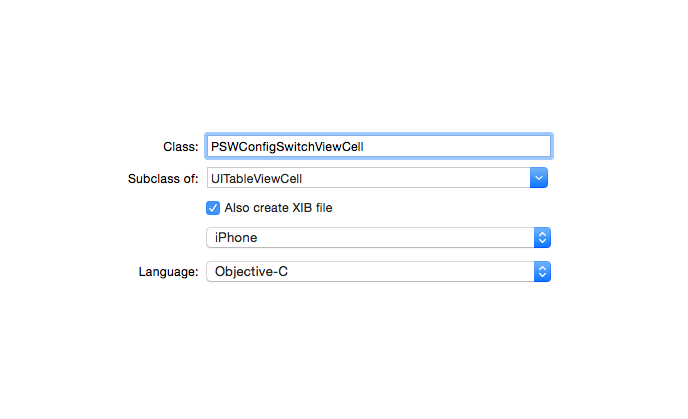
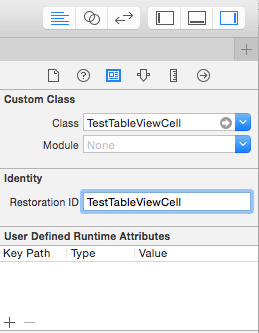

### 变更记录

| 序号 | 录入时间 | 录入人 | 备注 |
|:--------:|:--------:|:--------:|:--------:|
| 1 | 2015-08-24 | [Alfred Jiang](https://github.com/viktyz) | - |
| 2 | 2015-12-23 | [Alfred Jiang](https://github.com/viktyz) | - |
| 2 | 2016-03-11 | [Alfred Jiang](https://github.com/viktyz) | - |

### 方案名称

Xib - 通过 Xib 加载自定义 Cell

### 关键字

Xib \ UITableViewCell \ 自定义

### 需求场景

1. 需要实现较为复杂的 cell 布局，通过 xib 方式实现

### 参考链接
1. [简书 - iOS 自定义Cell-通过XIB方式](http://www.jianshu.com/p/8c6c54eaffb3)

### 详细内容

##### 2016-03-11 更新

1. 通过 File -> New -> File... -> iOS -> Source -> Cocoa Touch Class 创建 Cell
2. 在 Class 中输入自定义 Cell 名称(示例：PSWConfigSwitchViewCell)；在 Subclass of 中输入父类 UITableViewCell ; 勾选 Also create Xib file 选项 ； 选择平台（iPhone / iPad） 和语言（Objective-C / Swift）

    
3. 在 PSWConfigSwitchViewCell.h 中申明初始化方法

```objectivec
+ (instancetype)cellWithTableView:(UITableView *)tableView;
```
4. 在 PSWConfigSwitchViewCell.m 中实现初始化方法

```objectivec
+ (instancetype)cellWithTableView:(UITableView *)tableView
{
    static NSString *identifer = @"PSWConfigSwitchViewCell";
    
    PSWConfigSwitchViewCell *cell = [tableView dequeueReusableCellWithIdentifier:identifer];
    
    if (cell == nil) {
        cell = [[[NSBundle mainBundle] loadNibNamed:@"PSWConfigSwitchViewCell" owner:nil options:nil] firstObject];
    }
    
    return cell;
}
```
5. 在 cellForRowAtIndexPath 方法中加载自定义 Cell

```objectivec
- (UITableViewCell *)tableView:(UITableView *)tableView cellForRowAtIndexPath:(NSIndexPath *)indexPath
{
    PSWConfigSwitchViewCell *cell = [PSWConfigSwitchViewCell cellWithTableView:tableView];
    // Config Your Cell
    return cell;
}
```
6. 可以在 PSWConfigSwitchViewCell.xib 中布局更多控件并关联 PSWConfigSwitchViewCell 类，亦可以在 PSWConfigSwitchViewCell.(h/m) 中申明实现更多自定义方法。

##### 2015-12-23 之前创建

1. 通过 File -> New -> File... -> iOS -> Source -> Cocoa Touch Class 创建 Cell
2. 在 Class 中输入自定义 Cell 名称(示例：TestTableViewCell)；在 Subclass of 中输入父类 UITableViewCell ; 勾选 Also create Xib file 选项 ； 选择平台（iPhone / iPad） 和语言（Objective-C / Swift）

    
3. 下面进入 TestTableViewCell.xib -> Test TableView Cell -> Utilities 面板 -> Show the Indentity inspector
4. 在 Restoration ID 中输入重用 ID(示例：TestTableViewCell), 这个 ID 将用于重用 cell
    
    
5. 在 ViewDidLoad 方法中向使用该 Cell 的 UITableView 注册 Xib 定义的 Cell.

```objectivec
    [self.tableViewMain registerNib:[UINib nibWithNibName:NSStringFromClass([TestTableViewCell class]) bundle:nil] forCellReuseIdentifier:@"TestTableViewCell"];
```
6. 在 cellForRowAtIndexPath 方法中加载自定义 Cell

```objectivec
    - (UITableViewCell *)tableView:(UITableView *)tableView cellForRowAtIndexPath:(NSIndexPath *)indexPath
    {
        static NSString *aTestTableViewCell = @"TestTableViewCell";
        TestTableViewCell *cell = (TestTableViewCell*)[tableView dequeueReusableCellWithIdentifier:aTestTableViewCell];
        if (!cell)
        {
            NSArray *nib = [[NSBundle mainBundle] loadNibNamed:@"TestTableViewCell" owner:[TestTableViewCell class] options:nil];
            cell = (TestTableViewCell *)[nib objectAtIndex:0];  //这里的 0 表示 xib 中第 1 个View，也就是 Test TableView Cell
        }
        cell.selectionStyle = UITableViewCellSelectionStyleNone;
        //...
        return cell;
    }
```

### 效果图
（无）

### 备注

尽量避免在 cell 的数据加载中进行数据运算，相关 cell 的显示依赖数据，尽量在 Model 中初始化完成， cell 直接读取显示。更多参考

* [UITableView - 滑动加载性能优化总结](Note_00122_20151223.md)
