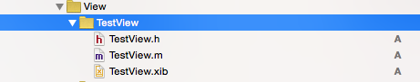

### 变更记录

| 序号 | 录入时间 | 录入人 | 备注 |
|:--------:|:--------:|:--------:|:--------:|
| 1 | 2015-08-24 | [Alfred Jiang](https://github.com/viktyz) | - |
| 2 | 2015-12-23 | [Alfred Jiang](https://github.com/viktyz) | - |

### 方案名称

Xib - 通过 Xib 加载自定义 View

### 关键字

Xib \ UIView \ 自定义

### 需求场景

1. 需要实现较为复杂的 View 布局，通过 xib 方式实现

### 参考链接
（无）

### 详细内容

#####1. 通过 File -> New -> File... -> iOS -> Source -> Cocoa Touch Class 创建 View 的 Class 文件

#####2. 在 Class 中输入自定义 View 名称(示例：TestView)；在 Subclass of 中输入父类 UIView ; 此处无法勾选 Also create Xib file 选项（不用着急，往下看） ； 选择平台（iPhone / iPad） 和语言（Objective-C / Swift）
 

#####3. 通过 File -> New -> File... -> iOS -> User Interface -> View 创建 View 的 Xib 文件（示例命名为TestView）
 

创建完成显示如下

 

#####4. 下面进入 TestView.xib -> View -> Utilities 面板 -> Show the Indentity inspector

#####5. 在 Class 中输入对应View 的 Class 名称(示例：TestView), 这样就实现了 Xib 和类文件的关联，现在你可以像在 UIViewController 的 Xib 中拖动控件一样的在 View 上拖动关联控件了
（注意，此时 xib 与 Class 发生关联的是 View 而不是 Files's Owner, 这与 UIViewController 和 xib 的关联方式不同）

 

#####5. 在需要加载 xib 自定义 View 的地方使用如下代码加载
```objectivec
NSArray *nib = [[NSBundle mainBundle] loadNibNamed:@"TestView" owner:self options:nil];
TestView *tmpView = (TestView *)[nib objectAtIndex:0];
//这里的 0 表示 xib 中第 1 个View，你可以尝试为一个 View 的 Class 添加多个 View 控件
```

### 效果图
（无）

### 备注

1. View 是一个显示控件，尽量避免在 View 的 Class 中执行过多的逻辑运算和控制代码， View 应该通过 show 对应 Model 的方式显示自己的数据。
