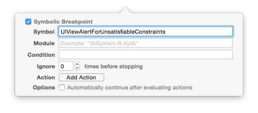
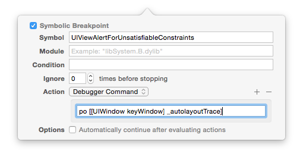

### 变更记录

| 序号 | 录入时间 | 录入人 | 备注 |
|:--------:|:--------:|:--------:|:--------:|
| 1 | 2016-01-05 | [Alfred Jiang](https://github.com/viktyz) | - |

### 方案名称

Auto Layout -  约束冲突断点调试方法

### 关键字

Auto Layout \ 调试 \ 断点 \ 约束冲突

### 需求场景

1. 遇到 Auto Layout 约束冲突时

### 参考链接

1. [NSHint - Autolayout Breakpoints](http://nshint.io/blog/2015/08/17/autolayout-breakpoints/?utm_campaign=iOS%2bDev%2bWeekly&utm_medium=web&utm_source=iOS_Dev_Weekly_Issue_212)

### 详细内容

当遇到以下 Auto Layout 约束冲突提示时
```
Unable to simultaneously satisfy constraints.
Probably at least one of the constraints in the following list is one you don't want.
Try this:

(1) look at each constraint and try to figure out which you don't expect;
(2) find the code that added the unwanted constraint or constraints and fix it.
(Note: If you're seeing NSAutoresizingMaskLayoutConstraints that you don't understand, refer to the documentation for the UIView property translatesAutoresizingMaskIntoConstraints)

(...........)

Make a symbolic breakpoint at UIViewAlertForUnsatisfiableConstraints to catch this in the debugger.
The methods in the UIConstraintBasedLayoutDebugging category on UIView listed in <UIKit/UIView.h> may also be helpful.
```

可以通过添加以下断点定位约束冲突



通过添加以下设置，可以观察到全部的 *UIView* 层级关系以及 *AMBIGUOUS LAYOUT* 提示（*AMBIGUOUS LAYOUT* 即为约束冲突或不完善位置），更好的定位约束冲突



```
UIWindow:0x7f9481c93360
|   •UIView:0x7f9481c9d680
|   |   *UIView:0x7f9481c9d990- AMBIGUOUS LAYOUT for UIView:0x7f9481c9d990.minX{id: 13}, UIView:0x7f9481c9d990.minY{id: 16}
|   |   *_UILayoutGuide:0x7f9481c9e160- AMBIGUOUS LAYOUT for _UILayoutGuide:0x7f9481c9e160.minY{id: 17}
|   |   *_UILayoutGuide:0x7f9481c9ebb0- AMBIGUOUS LAYOUT for _UILayoutGuide:0x7f9481c9ebb0.minY{id: 27}

```

还可以通过 expr 命令动态修改页面参数，帮助定位控件位置

```
(lldb) expr ((UIView *)0x7f9ea3d43410).backgroundColor = [UIColor redColor]
(UICachedDeviceRGBColor *) $1 = 0x00007f9ea3d43410
```

### 效果图
（无）

### 备注

* [Xcode - 使用 LLDB 调试代码](Note_00126_20151224.md)
* [Xcode - 调试相关](Note_00055_20151222.md)