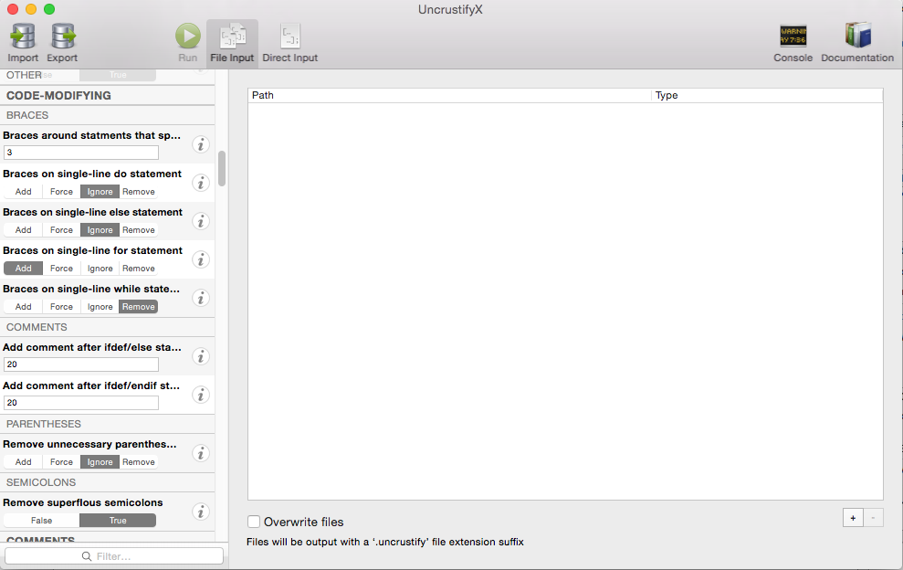

### 变更记录

| 序号 | 录入时间 | 录入人 | 备注 |
|:--------:|:--------:|:--------:|:--------:|
| 1 | 2016-03-15 | [Alfred Jiang](https://github.com/viktyz) | - |

### 方案名称

Xcode - 使用 BBUncrustifyPlugin-Xcode 插件实现代码格式化

### 关键字

Xcode \ BBUncrustifyPlugin \ 代码格式化

### 需求场景

1. 实现统一风格的代码

### 参考链接

1. [Xcode插件 BBUncrustifyPlugin-Xcode](http://see.sl088.com/wiki/Xcode%E6%8F%92%E4%BB%B6_BBUncrustifyPlugin-Xcode)
2. [Uncrustify/UncrustifyX 配置工具](http://see.sl088.com/wiki/Uncrustify/UncrustifyX_%E9%85%8D%E7%BD%AE%E5%B7%A5%E5%85%B7)
2. [GitHub - BBUncrustifyPlugin-Xcode](https://github.com/benoitsan/BBUncrustifyPlugin-Xcode)
3. [GitHub - UncrustifyX](https://github.com/ryanmaxwell/UncrustifyX)

### 详细内容

##### 1. 安装（仅介绍最简单方式，更多安装方式参考[GitHub](https://github.com/benoitsan/BBUncrustifyPlugin-Xcode)）

1. [*点击这里*](https://github.com/benoitsan/BBUncrustifyPlugin-Xcode/releases) 下载 BBUncrustifyPlugin-Xcode 最新发布版本
2. 解压下载文件，复制 *UncrustifyPlugin.xcplugin* 到 *~/Library/Application Support/Developer/Shared/Xcode/Plug-ins* 文件夹下
3. 重启 Xcdoe，即可在 *Edit* 选项下看到 *Format Code*


##### 2. 使用（仅介绍快速使用方法，使用[ryan-objc.cfg](https://gist.github.com/ryanmaxwell/4242629#file-ryan-objc-cfg)作为初始 Objective-C 配置文件）

1. [*点击这里*](https://gist.github.com/ryanmaxwell/4242629#file-ryan-objc-cfg) 下载 Objective-C 配置文件
2. 复制 *ryan-objc.cfg* 到 *~/.uncrustify* 文件夹下（若没有则创建 .uncrustify 文件夹）
3. 进入 *Xcdoe* ，选中需要格式化的代码，选择 *Edit -> Format Code -> Format Selected Lines* 即可格式化代码


##### 3. 配置（[UncrustifyX](https://github.com/ryanmaxwell/UncrustifyX) 配置工具的下载使用）

1. [*点击这里*](https://github.com/ryanmaxwell/UncrustifyX/releases) 下载 UncrustifyX 最新发布版本
2. 解压下载文件，拖动 *UncrustifyX* 至 *Applications* 文件夹
3. 进入 *Xcdoe* ，选择 *Edit -> Format Code -> BBUncrustifyPlugin Preferences* ,设置 *Configuration Editor* 为 *UncrustifyX*
4. 选择 *Edit -> Format Code -> Edit Uncrustify Configuration* 既可通过 *UncrustifyX* 配置 cfg 文件



### 效果图
（无）

### 备注

ryan-objc.cfg 文件

```shell
#
# Uncrustify Configuration File
# File Created With UncrustifyX 0.2 (140)
#

# Alignment
# ---------

## Alignment

# Align obj-c declaration params on colon
align_oc_decl_colon                     = true          # boolean (false/true)

# Align on tabstop
align_on_tabstop                        = false         # boolean (false/true)

# Align variable definitions
align_func_params                       = true          # boolean (false/true)

# Align with tabs
align_with_tabs                         = false         # boolean (false/true)

# Keep non-indenting tabs
align_keep_tabs                         = false         # boolean (false/true)

## Alignment Span

# Alignment span for #define bodies
align_pp_define_span                    = 8             # number

# Alignment span for equals in enums
align_enum_equ_span                     = 4             # number

# Alignment span for obj-c message colons
align_oc_msg_colon_span                 = 20            # number

# Alignment span for obj-c message spec
align_oc_msg_spec_span                  = 20            # number

# Alignment span for single-line typedefs
align_typedef_span                      = 5             # number

# Alignment span for struct initializer values
align_struct_init_span                  = 4             # number

# Alignment span for trailing comments
align_right_cmt_span                    = 8             # number

## Alignment Style

# Alignment style for star in variable definitions
align_var_def_star_style                = 1             # number

## Gap

# Minimum gap between type and synonym of typedef
align_typedef_gap                       = 3             # number

# Minimum gap for trailing comment
align_right_cmt_gap                     = 8             # number

## Other

# Always align with first parameter in obj-c message
align_oc_msg_colon_first                = false         # boolean (false/true)

# Blank Lines
# -----------

## Newline Count After

# Newline count after function body
nl_after_func_body                      = 2             # number

# Newline count after single-line function body
nl_after_func_body_one_liner            = 2             # number

# Newline count after variable definition block
nl_func_var_def_blk                     = 1             # number

## Other

# Remove blank lines after open brace
eat_blanks_after_open_brace             = true          # boolean (false/true)

# Remove blank lines before close brace
eat_blanks_before_close_brace           = true          # boolean (false/true)

# Code-Modifying
# --------------

## Braces

# Braces around statments that span N newlines
mod_full_brace_nl                       = 3             # number

# Braces on single-line do statement
mod_full_brace_do                       = ignore        # string (add/force/ignore/remove)

# Braces on single-line else statement
mod_full_brace_if                       = ignore        # string (add/force/ignore/remove)

# Braces on single-line for statement
mod_full_brace_for                      = add           # string (add/force/ignore/remove)

# Braces on single-line while statement
mod_full_brace_while                    = remove        # string (add/force/ignore/remove)

## Comments

# Add comment after ifdef/else statement of size
mod_add_long_ifdef_else_comment         = 20            # number

# Add comment after ifdef/endif statement of size
mod_add_long_ifdef_endif_comment        = 20            # number

## Parentheses

# Remove unnecessary parentheses on return statement
mod_paren_on_return                     = ignore        # string (add/force/ignore/remove)

## Semicolons

# Remove superflous semicolons
mod_remove_extra_semicolon              = true          # boolean (false/true)

# Comments
# --------

## Empty Lines

# Empty first line for multi-line C comments
cmt_c_nl_start                          = true          # boolean (false/true)

# Empty first line for multi-line C++ comments
cmt_cpp_nl_start                        = true          # boolean (false/true)

## Other

# Stars on multi-line comments
cmt_star_cont                           = false         # boolean (false/true)

# General
# -------

## Other

# Newline character
newlines                                = lf            # string (auto/cr/crlf/lf)

# Output tab size
output_tab_size                         = 4             # number

# Indentation
# -----------

## Indentation

# Indent obj-c block
indent_oc_block                         = true          # boolean (false/true)

## Indentation Size

# Indentation column size
indent_columns                          = 4             # number

# Indentation size between case and switch
indent_switch_case                      = 4             # number

# Indentation size for obj-c blocks in a message parameter
indent_oc_block_msg                     = 4             # number

# Indentation size for obj-c message subsequent parameters
indent_oc_msg_colon                     = 4             # number

## Other

# Align continued statements at equals
indent_align_assign                     = false         # boolean (false/true)

# Indent goto labels
indent_label                            = 2             # number

# Indent with tabs
indent_with_tabs                        = 0             # number

# Newlines
# --------

## Merging

# Change unbraced if statements into one-liner
nl_create_if_one_liner                  = true          # boolean (false/true)

## Newline After

# Newline after brace open
nl_after_brace_open                     = false         # boolean (false/true)

# Newline after for
nl_after_for                            = force         # string (add/force/ignore/remove)

# Newline after if
nl_after_if                             = force         # string (add/force/ignore/remove)

# Newline after macro multi-line definition
nl_multi_line_define                    = true          # boolean (false/true)

# Newline after return
nl_after_return                         = true          # boolean (false/true)

## Newline Before

# Newline before case statement
nl_before_case                          = true          # boolean (false/true)

# Newline before for
nl_before_for                           = force         # string (add/force/ignore/remove)

# Newline before if
nl_before_if                            = force         # string (add/force/ignore/remove)

# Newline before while
nl_before_while                         = force         # string (add/force/ignore/remove)

## Newline Between

# Newline between case colon and open brace
nl_case_colon_brace                     = remove        # string (add/force/ignore/remove)

# Newline between catch and open brace
nl_catch_brace                          = remove        # string (add/force/ignore/remove)

# Newline between close brace and catch
nl_brace_catch                          = remove        # string (add/force/ignore/remove)

# Newline between close brace and else
nl_brace_else                           = remove        # string (add/force/ignore/remove)

# Newline between close brace and finally
nl_brace_finally                        = remove        # string (add/force/ignore/remove)

# Newline between close brace and while
nl_brace_while                          = remove        # string (add/force/ignore/remove)

# Newline between close parenthesis and open brace in multi line conditional
nl_multi_line_cond                      = false         # boolean (false/true)

# Newline between do and open brace
nl_do_brace                             = remove        # string (add/force/ignore/remove)

# Newline between else and open brace
nl_else_brace                           = remove        # string (add/force/ignore/remove)

# Newline between else if and open brace
nl_elseif_brace                         = remove        # string (add/force/ignore/remove)

# Newline between enum and open brace
nl_enum_brace                           = remove        # string (add/force/ignore/remove)

# Newline between finally and open brace
nl_finally_brace                        = remove        # string (add/force/ignore/remove)

# Newline between for and open brace
nl_for_brace                            = remove        # string (add/force/ignore/remove)

# Newline between function call and open brace
nl_fcall_brace                          = remove        # string (add/force/ignore/remove)

# Newline between function signature and open brace
nl_fdef_brace                           = remove        # string (add/force/ignore/remove)

# Newline between if and open brace
nl_if_brace                             = remove        # string (add/force/ignore/remove)

# Newline between struct and open brace
nl_struct_brace                         = remove        # string (add/force/ignore/remove)

# Newline between switch and open brace
nl_switch_brace                         = remove        # string (add/force/ignore/remove)

# Newline between try and open brace
nl_try_brace                            = remove        # string (add/force/ignore/remove)

# Newline between union and open brace
nl_union_brace                          = remove        # string (add/force/ignore/remove)

# Newline between while and open brace
nl_while_brace                          = remove        # string (add/force/ignore/remove)

## Other

# Don't split one-line obj-c messages
nl_oc_msg_leave_one_liner               = true          # boolean (false/true)

# Newlines at end of file
nl_end_of_file                          = add           # string (add/force/ignore/remove)

# Place obj-c message parameters on new lines
nl_oc_msg_args                          = true          # boolean (false/true)

# Spacing
# -------

## Space After

# Space after C++ comment opening
sp_cmt_cpp_start                        = ignore        # string (add/force/ignore/remove)

# Space after cast
sp_after_cast                           = remove        # string (add/force/ignore/remove)

# Space after class colon
sp_after_class_colon                    = force         # string (add/force/ignore/remove)

# Space after comma
sp_after_comma                          = add           # string (add/force/ignore/remove)

# Space after condition close parenthesis
sp_after_sparen                         = force         # string (add/force/ignore/remove)

# Space after obj-c block caret
sp_after_oc_block_caret                 = remove        # string (add/force/ignore/remove)

# Space after obj-c colon
sp_after_oc_colon                       = remove        # string (add/force/ignore/remove)

# Space after obj-c dictionary colon
sp_after_oc_dict_colon                  = add           # string (add/force/ignore/remove)

# Space after obj-c message colon
sp_after_send_oc_colon                  = remove        # string (add/force/ignore/remove)

# Space after obj-c property
sp_after_oc_property                    = add           # string (add/force/ignore/remove)

# Space after obj-c return type
sp_after_oc_return_type                 = remove        # string (add/force/ignore/remove)

# Space after obj-c scope
sp_after_oc_scope                       = force         # string (add/force/ignore/remove)

# Space after obj-c type
sp_after_oc_type                        = remove        # string (add/force/ignore/remove)

# Space after pointer star
sp_after_ptr_star                       = remove        # string (add/force/ignore/remove)

# Space after pointer star followed by function
sp_after_ptr_star_func                  = force         # string (add/force/ignore/remove)

## Space Around

# Space around arithmetic operators
sp_arith                                = add           # string (add/force/ignore/remove)

# Space around assignment operator
sp_assign                               = add           # string (add/force/ignore/remove)

# Space around boolean operators
sp_bool                                 = add           # string (add/force/ignore/remove)

# Space around compare operators
sp_compare                              = add           # string (add/force/ignore/remove)

# Space around ternary condition colon
sp_cond_colon                           = force         # string (add/force/ignore/remove)

# Space around ternary condition question mark
sp_cond_question                        = force         # string (add/force/ignore/remove)

## Space Before

# Space before case colon
sp_before_case_colon                    = remove        # string (add/force/ignore/remove)

# Space before class colon
sp_before_class_colon                   = force         # string (add/force/ignore/remove)

# Space before if/for/switch/while open parenthesis
sp_before_sparen                        = force         # string (add/force/ignore/remove)

# Space before obj-c block caret
sp_before_oc_block_caret                = ignore        # string (add/force/ignore/remove)

# Space before obj-c colon
sp_before_oc_colon                      = remove        # string (add/force/ignore/remove)

# Space before obj-c dictionary colon
sp_before_oc_dict_colon                 = remove        # string (add/force/ignore/remove)

# Space before obj-c message colon
sp_before_send_oc_colon                 = remove        # string (add/force/ignore/remove)

# Space before pointer star
sp_before_ptr_star                      = force         # string (add/force/ignore/remove)

# Space before pointer star followed by function
sp_before_ptr_star_func                 = force         # string (add/force/ignore/remove)

# Space before unnamed pointer star
sp_before_unnamed_ptr_star              = ignore        # string (add/force/ignore/remove)

## Space Between

# Space between @selector and open parenthesis
sp_after_oc_at_sel                      = remove        # string (add/force/ignore/remove)

# Space between catch and open brace
sp_catch_brace                          = add           # string (add/force/ignore/remove)

# Space between catch and open parenthesis
sp_catch_paren                          = add           # string (add/force/ignore/remove)

# Space between close brace and else
sp_brace_else                           = force         # string (add/force/ignore/remove)

# Space between close parenthesis and open brace
sp_paren_brace                          = force         # string (add/force/ignore/remove)

# Space between closing brace and catch
sp_brace_catch                          = add           # string (add/force/ignore/remove)

# Space between closing brace and finally
sp_brace_finally                        = add           # string (add/force/ignore/remove)

# Space between closing parenthesis and open brace
sp_fparen_brace                         = force         # string (add/force/ignore/remove)

# Space between else and open brace
sp_else_brace                           = force         # string (add/force/ignore/remove)

# Space between finally and open brace
sp_finally_brace                        = add           # string (add/force/ignore/remove)

# Space between function name and open parenthesis
sp_func_call_paren                      = remove        # string (add/force/ignore/remove)

# Space between function name and open parenthesis in declaration
sp_func_proto_paren                     = remove        # string (add/force/ignore/remove)

# Space between function name and open parenthesis in function definition
sp_func_def_paren                       = remove        # string (add/force/ignore/remove)

# Space between pointer stars
sp_between_ptr_star                     = remove        # string (add/force/ignore/remove)

# Space between sizeof and open parenthesis
sp_sizeof_paren                         = remove        # string (add/force/ignore/remove)

# Space between try and open brace
sp_try_brace                            = add           # string (add/force/ignore/remove)

## Space Inside

# Space inside @selector() parens
sp_inside_oc_at_sel_parens              = remove        # string (add/force/ignore/remove)

# Space inside braces
sp_inside_braces                        = add           # string (add/force/ignore/remove)

# Space inside cast parentheses
sp_inside_paren_cast                    = remove        # string (add/force/ignore/remove)

# Space inside enum braces
sp_inside_braces_enum                   = add           # string (add/force/ignore/remove)

# Space inside function parentheses
sp_inside_fparen                        = remove        # string (add/force/ignore/remove)

# Space inside if-condition parentheses
sp_inside_sparen                        = remove        # string (add/force/ignore/remove)

# Space inside parentheses
sp_inside_paren                         = remove        # string (add/force/ignore/remove)

# Space inside parentheses in function type
sp_inside_tparen                        = remove        # string (add/force/ignore/remove)

# Space inside struct/union braces
sp_inside_braces_struct                 = add           # string (add/force/ignore/remove)
```
