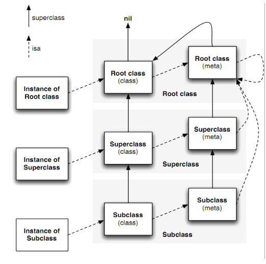

### 变更记录

| 序号 | 录入时间 | 录入人 | 备注 |
|:--------:|:--------:|:--------:|:--------:|
| 1 | 2016-03-22 | [Alfred Jiang](https://github.com/viktyz) | - |

### 方案名称

语法 - Objective-C 中的 Meta-class 是什么

### 关键字

语法 \ Meta-class \ 元类

### 需求场景

1. 熟悉 Objective-C 类结构

### 参考链接

1. [伯乐在线 - Objective-C 中的 Meta-class 是什么](http://blog.jobbole.com/53824/)
2. [Cocoa with Love - What is a meta-class in Objective-C?](http://www.cocoawithlove.com/2010/01/what-is-meta-class-in-objective-c.html)

### 详细内容
（见参考链接）

### 效果图
（无）

### 备注
（无）
