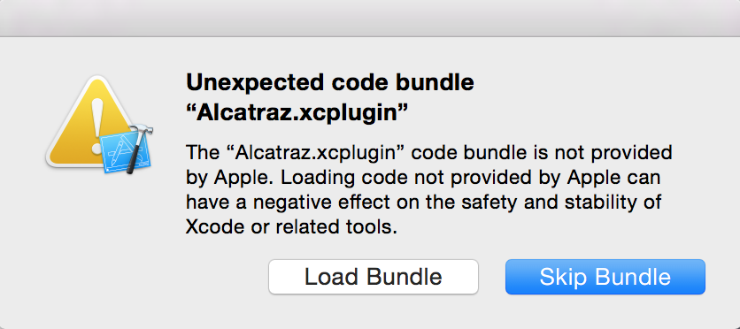
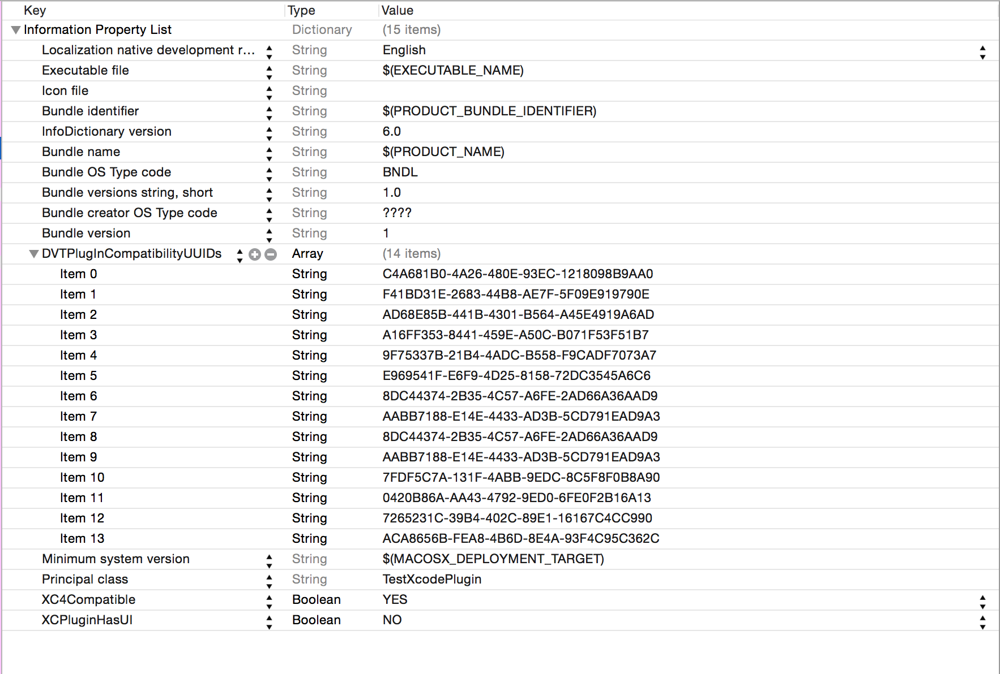
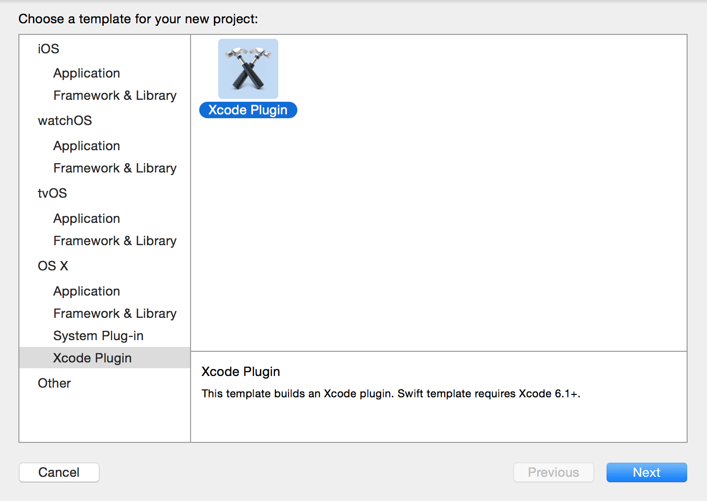
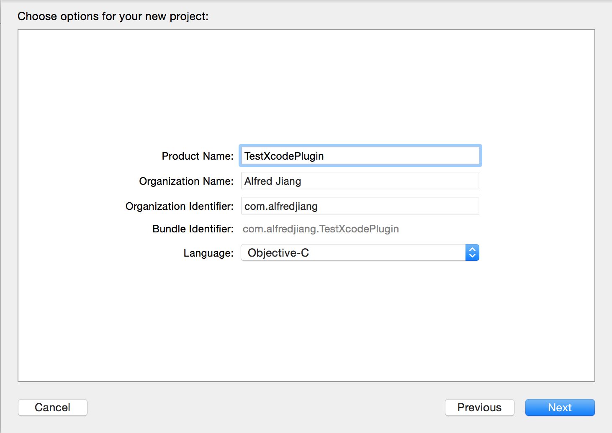
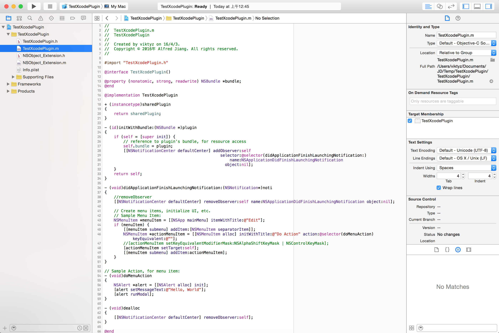

### 变更记录

| 序号 | 录入时间 | 录入人 | 备注 |
|:--------:|:--------:|:--------:|:--------:|
| 1 | 2016-03-29 | [Alfred Jiang](https://github.com/viktyz) | - |
| 2 | 2016-03-31 | [Alfred Jiang](https://github.com/viktyz) | - |

### 方案名称

Xcode - 插件开发学习备忘

### 关键字

Xcode \ 插件开发 \ 开发插件

### 需求场景

1. 开发自定义 Xcode 插件

### 参考链接

1. [OneV's Den - Xcode 4 插件制作入门](https://onevcat.com/2013/02/xcode-plugin/)(推荐)
2. [CocoaChina - Xcode 6 插件开发入门：添加自己的想法和功能](http://www.cocoachina.com/ios/20150506/11765.html)
3. [Forkong - Xcode7 插件开发：从开发到pull到Alcatraz](http://ifujun.com/xcode7-cha-jian-kai-fa-cong-kai-fa-dao-pulldao-alcatraz/)
4. [ManiacDev - Xcode Plugin Guide – Find Xcode Plugins](https://maniacdev.com/xcode-plugins)
5. [GitHub - Forkong/FKConsole](https://github.com/Forkong/FKConsole)
6. [GitHub - macoscope/CodePilot](https://github.com/macoscope/CodePilot)(推荐)
7. [GitHub - zulkis/ZKKeyBindingsTeacher](https://github.com/zulkis/ZKKeyBindingsTeacher)

### 详细内容

#### 1. 通过插件开发模板创建一个插件

##### (1) 安装 [Alcatraz](http://alcatraz.io/) 

>curl -fsSL https://raw.githubusercontent.com/supermarin/Alcatraz/deploy/Scripts/install.sh | sh 

##### (2) 重启 Xcode 选择 Load Bundle,通过 Window -> Package Manager 安装 [Xcode Plugin](https://github.com/kattrali/Xcode-Plugin-Template)




注：
1. 如果无法通过 Alcatraz 安装 Xcode Plugin，可以在 [GitHub](https://github.com/kattrali/Xcode-Plugin-Template) 上直接下载 Xcode Plugin 编译运行，亦可自动安装插件开发模板
2. 安装 Xcode Plugin 前可通过以下命令获取 Xcode UUID ,并在 info.plist -> DVTPlugInCompatibilityUUIDs 中添加该 UUID, 否则无法正常安装
>defaults read /Applications/Xcode.app/Contents/Info DVTPlugInCompatibilityUUID



##### (3) 通过 File -> New -> Project -> Xcode Plugin 创建一个插件模板工程 TestXcodePlugin







#### 2. 为自定义插件添加快捷键支持

##### (1) 添加 [IDEKeyBindingPreferenceSet.h](https://github.com/zulkis/ZKKeyBindingsTeacher/blob/master/ZKKeyBindingsTeacher/Classes/Model/IDEKeyBindingPreferenceSet.h), 该文件提供了 Xcode 快捷键绑定的私有接口

##### (2) 修改 TestXcodePlugin.m 文件如下
```objectivec
//
//  TestXcodePlugin.m
//  TestXcodePlugin
//
//  Created by viktyz on 16/4/3.
//  Copyright © 2016年 Alfred Jiang. All rights reserved.
//

#import "TestXcodePlugin.h"
#import "IDEKeyBindingPreferenceSet.h"


#define CP_DEFAULT_SHORTCUT      @"$@X" // for key binding system
#define DEFAULTS_KEY_BINDING     @"TestXcodePlugin.h"
#define CP_MENU_PARENT_TITLE     @"Edit"
#define CP_MENU_ITEM_TITLE       @"DoAction"


static NSString * const IDEKeyBindingSetDidActivateNotification = @"IDEKeyBindingSetDidActivateNotification";


@interface TestXcodePlugin()

@property (nonatomic, strong, readwrite) NSBundle *bundle;
@property (nonatomic, strong) NSMenuItem *actionMenuItem;

@end

@implementation TestXcodePlugin

+ (instancetype)sharedPlugin
{
    return sharedPlugin;
}

- (id)initWithBundle:(NSBundle *)plugin
{
    if (self = [super init]) {
        // reference to plugin's bundle, for resource access
        self.bundle = plugin;
        [[NSNotificationCenter defaultCenter] addObserver:self
                                                 selector:@selector(didApplicationFinishLaunchingNotification:)
                                                     name:NSApplicationDidFinishLaunchingNotification
                                                   object:nil];
    }
    return self;
}

- (void)didApplicationFinishLaunchingNotification:(NSNotification*)noti
{
    //removeObserver
    [[NSNotificationCenter defaultCenter] removeObserver:self name:NSApplicationDidFinishLaunchingNotification object:nil];
    
    [self setupKeyBindingsIfNeeded];
    [self installStandardKeyBinding];
    
    // Create menu items, initialize UI, etc.
    // Sample Menu Item:
    NSMenuItem *menuItem = [[NSApp mainMenu] itemWithTitle:CP_MENU_PARENT_TITLE];
    if (menuItem) {
        [[menuItem submenu] addItem:[NSMenuItem separatorItem]];
        self.actionMenuItem = [[NSMenuItem alloc] initWithTitle:CP_MENU_ITEM_TITLE action:@selector(doMenuAction) keyEquivalent:@""];
        //[actionMenuItem setKeyEquivalentModifierMask:NSAlphaShiftKeyMask | NSControlKeyMask];
        [self.actionMenuItem setTarget:self];
        [[menuItem submenu] addItem:self.actionMenuItem];
        [self updateMenuItem:self.actionMenuItem withShortcut:[self keyboardShortcutFromUserDefaults]];
    }
    
    [[NSNotificationCenter defaultCenter] addObserver:self
                                             selector:@selector(keyBindingsHaveChanged:)
                                                 name:IDEKeyBindingSetDidActivateNotification
                                               object:nil];
}

// Sample Action, for menu item:
- (void)doMenuAction
{
    NSAlert *alert = [[NSAlert alloc] init];
    [alert setMessageText:@"Hello, World"];
    [alert runModal];
}

- (void)dealloc
{
    [[NSNotificationCenter defaultCenter] removeObserver:self];
}

#pragma mark -

- (id<IDEKeyboardShortcut>)keyboardShortcutFromUserDefaults
{
    Class<IDEKeyboardShortcut> _IDEKeyboardShortcut = NSClassFromString(@"IDEKeyboardShortcut");
    return [_IDEKeyboardShortcut keyboardShortcutFromStringRepresentation:[self keyBindingFromUserDefaults]];
}

- (void)setupKeyBindingsIfNeeded
{
    if (IsEmpty([self keyBindingFromUserDefaults])) {
        [self saveKeyBindingToUserDefaults:CP_DEFAULT_SHORTCUT forKey:DEFAULTS_KEY_BINDING];
    }
}

- (NSString *)keyBindingFromUserDefaults
{
    return [[NSUserDefaults standardUserDefaults] valueForKey:DEFAULTS_KEY_BINDING];
}

- (void)saveKeyBindingToUserDefaults:(NSString *)keyBinding forKey:(NSString *)defaultsKey
{
    [[NSUserDefaults standardUserDefaults] setObject:keyBinding forKey:defaultsKey];
    [[NSUserDefaults standardUserDefaults] synchronize];
}

- (void)keyBindingsHaveChanged:(NSNotification *)notification
{
    [self updateKeyBinding:[self currentUserCPKeyBinding] forMenuItem:self.actionMenuItem defaultsKey:DEFAULTS_KEY_BINDING];
}

- (void)updateKeyBinding:(id<IDEKeyBinding>)keyBinding forMenuItem:(NSMenuItem *)menuItem defaultsKey:(NSString *)defaultsKey
{
    if ([[keyBinding keyboardShortcuts] count] > 0) {
        id<IDEKeyboardShortcut> keyboardShortcut = [[keyBinding keyboardShortcuts] objectAtIndex:0];
        [self saveKeyBindingToUserDefaults:[keyboardShortcut stringRepresentation] forKey:defaultsKey];
        [self updateMenuItem:menuItem withShortcut:keyboardShortcut];
    }
}

- (void)updateMenuItem:(NSMenuItem *)menuItem withShortcut:(id<IDEKeyboardShortcut>)keyboardShortcut
{
    [menuItem setKeyEquivalent:[keyboardShortcut keyEquivalent]];
    [menuItem setKeyEquivalentModifierMask:[keyboardShortcut modifierMask]];
}

- (id<IDEKeyBinding>)currentUserCPKeyBinding
{
    return [self menuKeyBindingWithItemTitle:CP_MENU_ITEM_TITLE underMenuCalled:CP_MENU_ITEM_TITLE];
}

- (id<IDEMenuKeyBinding>)menuKeyBindingWithItemTitle:(NSString *)itemTitle underMenuCalled:(NSString *)menuName
{
    Class<IDEKeyBindingPreferenceSet> _IDEKeyBindingPreferenceSet = NSClassFromString(@"IDEKeyBindingPreferenceSet");
    
    id<IDEKeyBindingPreferenceSet> currentPreferenceSet = [[_IDEKeyBindingPreferenceSet preferenceSetsManager] currentPreferenceSet];
    
    id<IDEMenuKeyBindingSet> menuKeyBindingSet = [currentPreferenceSet menuKeyBindingSet] ;
    
    for (id<IDEMenuKeyBinding> keyBinding in [menuKeyBindingSet keyBindings]) {
        if ([[keyBinding group] isEqualToString:menuName] && [[keyBinding title] isEqualToString:itemTitle]) {
            return keyBinding;
        }
    }
    
    return nil;
}

- (void)installStandardKeyBinding
{
    Class<IDEKeyBindingPreferenceSet> _IDEKeyBindingPreferenceSet = NSClassFromString(@"IDEKeyBindingPreferenceSet");
    
    id<IDEKeyBindingPreferenceSet> currentPreferenceSet = [[_IDEKeyBindingPreferenceSet preferenceSetsManager] currentPreferenceSet];
    
    id<IDEMenuKeyBindingSet> menuKeyBindingSet = [currentPreferenceSet menuKeyBindingSet];
    
    Class<IDEKeyboardShortcut> _IDEKeyboardShortcut = NSClassFromString(@"IDEKeyboardShortcut");
    
    id<IDEKeyboardShortcut> defaultShortcut = [_IDEKeyboardShortcut keyboardShortcutFromStringRepresentation:[self keyBindingFromUserDefaults]];
    
    Class<IDEMenuKeyBinding> _IDEMenuKeyBinding = NSClassFromString(@"IDEMenuKeyBinding");
    
    id<IDEMenuKeyBinding> cpKeyBinding = [_IDEMenuKeyBinding keyBindingWithTitle:CP_MENU_ITEM_TITLE
                                                                     parentTitle:CP_MENU_PARENT_TITLE
                                                                           group:CP_MENU_ITEM_TITLE
                                                                         actions:[NSArray arrayWithObject:@"whatever:"]
                                                               keyboardShortcuts:[NSArray arrayWithObject:defaultShortcut]];
    
    [cpKeyBinding setCommandIdentifier:CP_MENU_ITEM_TITLE];
    
    [menuKeyBindingSet insertObject:cpKeyBinding inKeyBindingsAtIndex:0];
    [menuKeyBindingSet updateDictionary];
}

#pragma mark -

static inline BOOL IsEmpty(id thing) {
    return thing == nil
    || ([NSNull null]==thing)
    || ([thing respondsToSelector:@selector(length)] && [(NSData *)thing length] == 0)
    || ([thing respondsToSelector:@selector(count)] && [(NSArray *)thing count] == 0);
}

@end
```

##### (3) 修改后，原插件操作按钮旁边会显示快捷键，使用快捷键可触发插件相应事件 


### 效果图
（无）

### 备注
（无）
