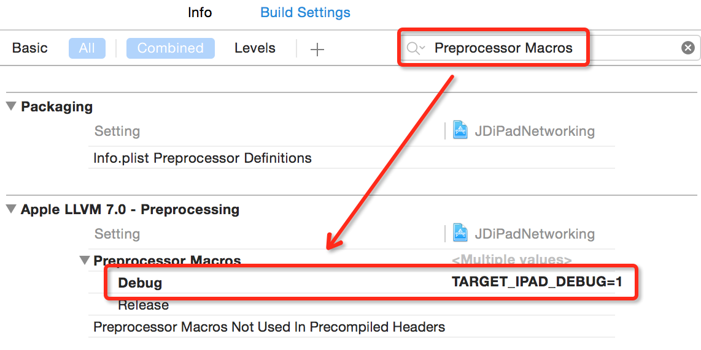

### 变更记录

| 序号 | 录入时间 | 录入人 | 备注 |
|:--------:|:--------:|:--------:|:--------:|
| 1 | 2016-04-26 | [Alfred Jiang](https://github.com/viktyz) | - |
| 1 | 2016-05-05 | [Alfred Jiang](https://github.com/viktyz) | 添加多条宏定义并使用逻辑与或操作 |

### 方案名称

Xcode - 在 Xcode 里添加和使用 Debug 宏定义

### 关键字

Xcode \ Debug 模式 \ 宏定义

### 需求场景

1. 需要为工程设置仅在 Debug 模式下有效的代码时

### 参考链接
1. [Wutiam - #ifdef 中的逻辑与或操作](http://wutiam.net/notes/109)

### 详细内容

###### 添加宏定义并使用

举例 : 添加 *TARGET_IPAD_DEBUG* 为 *Debug* 模式下特有宏定义

*Xcode -> 工程 Build Settings -> All -> Preprocessor Macros -> TARGET_IPAD_DEBUG=1*



```objectivec
#ifdef TARGET_IPAD_DEBUG
//...此处代码仅 Debug 模式下有效
#endif
```

###### 添加多条宏定义并使用逻辑与或操作

```objectivec
#if (!defined A) && (defined B)
//...此处代码仅 (!A && B) 时有效
#endif

#if (defined A) || (defined B)
//...此处代码仅 (A || B) 时有效
#endif
```

### 效果图
（无）

### 备注
（无）