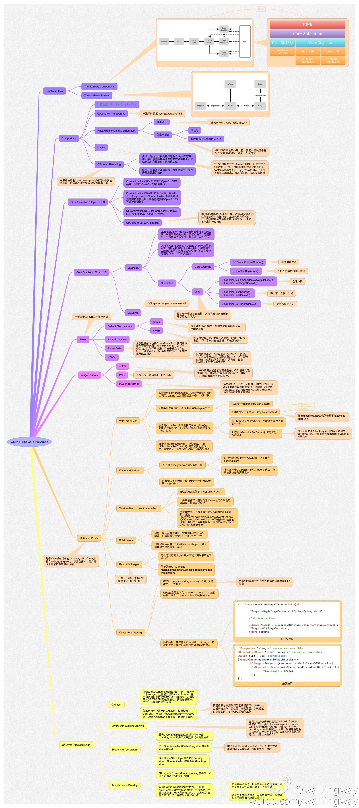
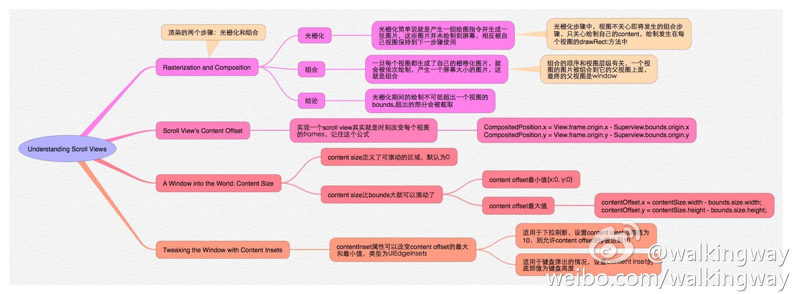
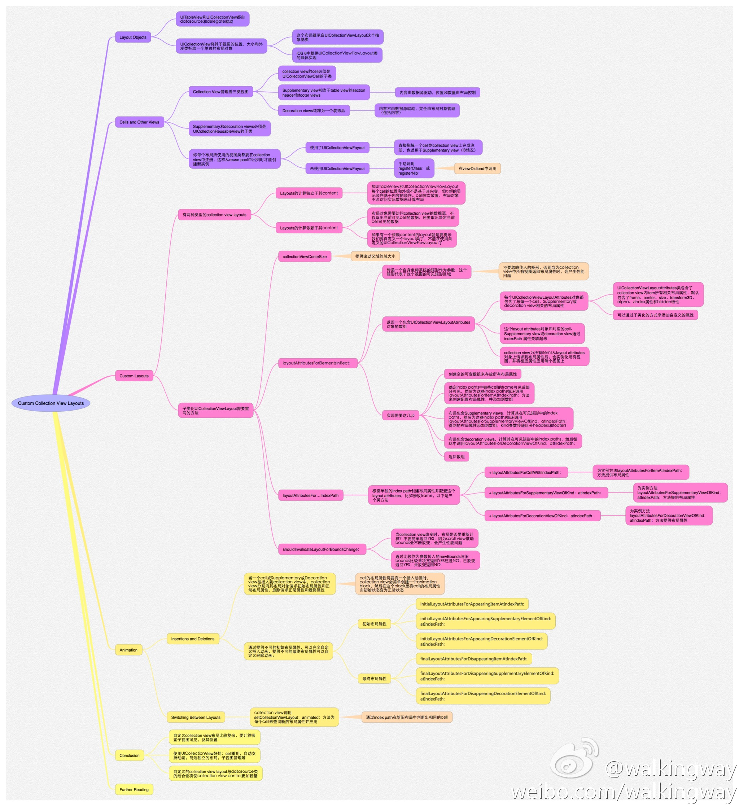
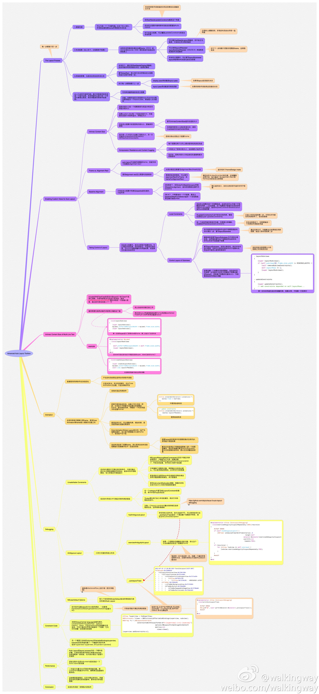

### 变更记录

| 序号 | 录入时间 | 录入人 | 备注 |
|:--------:|:--------:|:--------:|:--------:|
| 1 | 2016-09-30 | [Alfred Jiang](https://github.com/viktyz) | - |

### 方案名称

专题 - objc.io Issue 3: 视图 相关文章五篇

### 关键字

专题 \ Views \ 视图

### 需求场景

1. 熟悉 iOS 视图层相关编程

### 参考链接

1. [objc中国 - 期刊](https://www.objccn.io/issues/)(推荐)

### 详细内容

结合 [walkingway](http://weibo.com/p/1005051639057321/home?from=page_100505&mod=TAB&is_hot=1#place) 新浪微博提供的五张高清图，熟悉[《objc.io Issue 3: 视图》](https://www.objc.io/issues/3-views/) 期刊五篇关于 iOS 视图层编程的介绍文章。以下为[objc中国 - 期刊](https://www.objccn.io/issues/)中文翻译链接

* [绘制像素到屏幕上](https://www.objccn.io/issue-3-1/)
* [理解 Scroll Views](https://www.objccn.io/issue-3-2/)
* [自定义 Collection View 布局](https://www.objccn.io/issue-3-3/)
* [自定义控件](https://www.objccn.io/issue-3-4/)
* [先进的自动布局工具箱](https://www.objccn.io/issue-3-5/)

### 效果图

* 绘制像素到屏幕上

* 理解 Scroll Views

* 自定义 Collection View 布局

* 自定义控件

* 先进的自动布局工具箱

### 备注
（无）