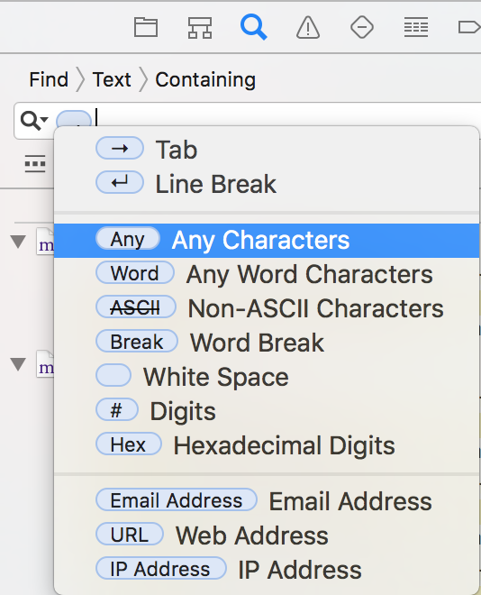
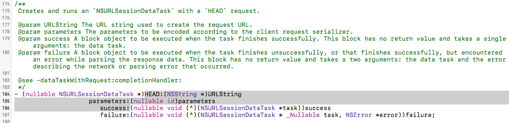
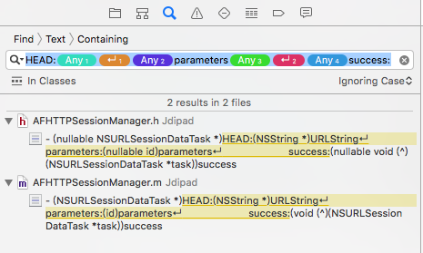
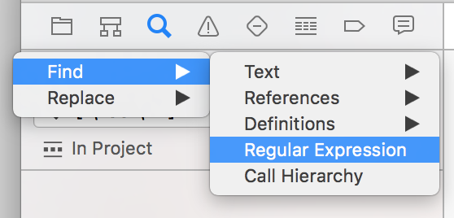

### 变更记录

| 序号 | 录入时间 | 录入人 | 备注 |
|:--------:|:--------:|:--------:|:--------:|
| 1 | 2016-11-09 | [Alfred Jiang](https://github.com/viktyz) | - |

### 方案名称

Xcode - 使用条件搜索替换和正则搜索替换

### 关键字

Xcode \ 条件搜索替换 \ 正则表达式搜索替换 \ 正则搜索替换 \ 条件查询替换 \ 正则查询替换

### 需求场景

1. 需要进行正则表达式搜索和替换时

### 参考链接

1. [CSDN - Xcode 中搜索任何条件文本](http://blog.csdn.net/justinjing0612/article/details/47132229)(推荐)

### 详细内容

以搜索为例，替换操作类似搜索操作

#### 1. 条件搜索

进入 Xcode 搜索标签页，选择 `Find -> Text -> Containing` , 点击搜索栏，使用快捷键 *control + option + command + p* , 从跳出的标志中选择即可

举例：查找 AFNetworking 中下面方法，使用条件搜索

#### 2. 正则搜索

进入 Xcode 搜索标签页，选择 `Find -> Regular Expression` , 点击搜索栏，输入查询正则表达式即可

举例：查找 AFNetworking 中下面方法，使用正则搜索

#### 常用条件搜索与正则搜索对应表

|条件搜索|正则搜索|备注|
|:--------:|:--------:|:--------:|
| Enter | ` ([\n\r]) ` | Line Break |
| Any | ` (.+?) ` | Any Characters |
| Word | ` (\w+) ` | Any Word Characters |
| None ASCII | ` ([^\00-\x7E]+) ` | Non-ASCII Characters(中文等) |
| Break | ` \b ` | Word Break |
| Space | ` (\s+) ` | White Space |
| # | ` (\d+) ` | Digits |
| Hex | ` ([:xdigit:]+) ` | Hexadecimal Digits |
| Email Address | ` (\b[A-Za-z0-9._%-]+@[A-Za-z0-9.-]+\.[A-Za-z]{2,4}\b) ` | Email Address(验证失效) |
| URL | ` (?:[A-Za-z][A-Za-z0-9+.-]{1,120}:[A-Za-z0-9/](?:(?:[A-Za-z0-9$_.+!*,;/?:@&~=-])|%[A-Fa-f0-9]{2}){1,333}(?:#(?:[a-zA-Z0-9][a-zA-Z0-9$_.+!*,;/?:@&~=%-]{0,1000}))?) ` | Web Address |
| IP Address | ` (?:\d{1,3}(?:\.\d{1,3}){3}|[:xdigit:]{1,4}(?::[:xdigit:]{1,4}){7}) ` | IP Address(验证失效) |

### 效果图
（无）

### 备注

* [正则表达式 - 在 iOS 开发中使用正则表达式](Note_00091_20151223.md)