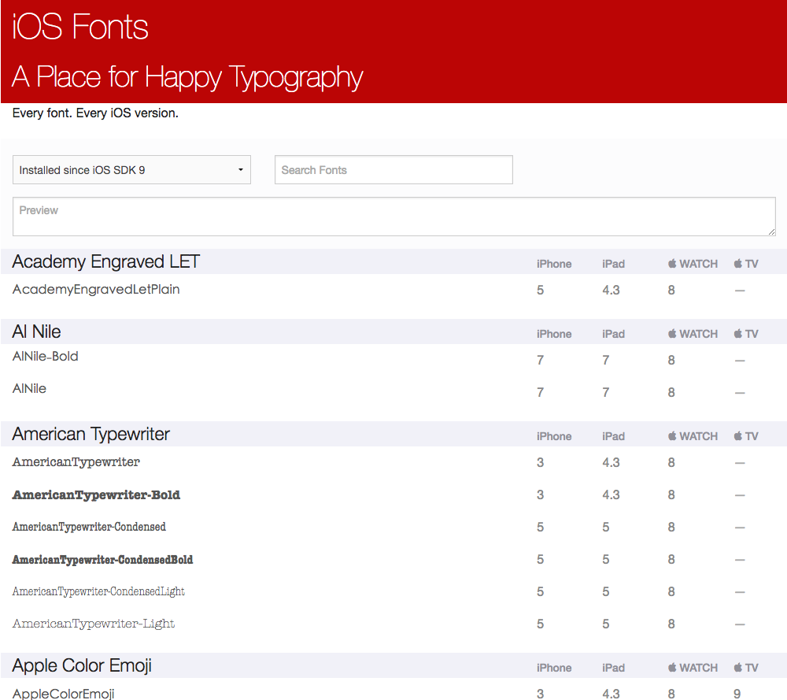

### 变更记录

| 序号 | 录入时间 | 录入人 | 备注 |
|:--------:|:--------:|:--------:|:--------:|
| 1 | 2016-11-30 | [Alfred Jiang](https://github.com/viktyz) | - |

### 方案名称

字体 - iOS 系统字体查询

### 关键字

字体 \ 系统字体

### 需求场景

1. 需要查询 iOS 设备系统支持字体时

### 参考链接

1. [iOS Fonts](http://iosfonts.com/)(推荐)

### 详细内容

#### 可以通过 [iOS Fonts](http://iosfonts.com/) 快速查询各个 iOS SDK 版本全部系统字体支持情况

### 效果图

### 备注

* [字体 - 添加自定义字体](Note_00116_20151223.md)