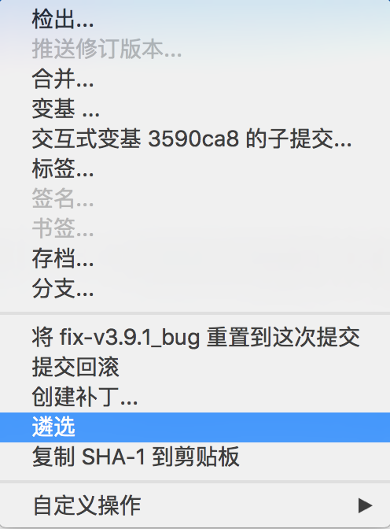

### 变更记录

| 序号 | 录入时间 | 录入人 | 备注 |
|:--------:|:--------:|:--------:|:--------:|
| 1 | 2016-12-02 | [Alfred Jiang](https://github.com/viktyz) | - |

### 方案名称

Git - 把指定 commit 合并到当前分支

### 关键字

Git \ 合并指定 commit 合并到当前分支

### 需求场景

1. 需要将其他分支 commit 合并至当前分支时

### 参考链接

1. [Segmentfault - git 为某次提交新建分支(只合并某次提交到一个分支上)](https://segmentfault.com/q/1010000002966347)(推荐)

### 详细内容

#### 1. 命名行方式

将 commit-id 的递交应用至当前分支

```shell
git cherry-pick commit-id
```

#### 2. SourceTree

选中想要合并至当前分支 -> 右键点击 -> 选择遴选 -> 确认




### 效果图
（无）

### 备注
（无）