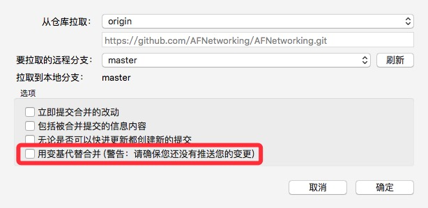
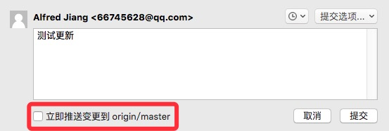

### 变更记录

| 序号 | 录入时间 | 录入人 | 备注 |
|:--------:|:--------:|:--------:|:--------:|
| 1 | 2016-12-20 | [Alfred Jiang](https://github.com/viktyz) | - |
| 1 | 2017-03-15 | [Alfred Jiang](https://github.com/viktyz) | 更新"注意事项"部分 |

### 方案名称

Git - 使用 rebase 命令保持主分支树的整洁

### 关键字

Git \ rebase \ merge \ 分支 \ 合并

### 需求场景

1. 合并主分支至子分支时，使用 rebase 保持主分支树的整洁，方便版本回退和问题追踪
2. 主要用在从主分支获取最新 commit 信息，并将当前子分支与主分支进行合并

### 参考链接

1. [Git Community Book 中文版 - rebase](http://gitbook.liuhui998.com/4_2.html)(推荐) 
2. [Git Community Book 中文版](http://gitbook.liuhui998.com/index.html)
3. [i@2(7*2d - Git教程(7)用合并还是变基？](http://www.cnblogs.com/sjjg/p/4979417.html)

### 详细内容

#### rebase 介绍

关于 rebase 的使用场景说明可以参考以下链接

* [Segmentfault - 团队开发里频繁使用 git rebase 来保持树的整洁好吗?](https://segmentfault.com/q/1010000000430041)
* [知乎 - 在开发过程中使用git rebase还是git merge，优缺点分别是什么？](https://www.zhihu.com/question/36509119/answer/67828312)

关于 rebase 的具体使用方法可以参考以下链接

* [Git Community Book 中文版 - rebase](http://gitbook.liuhui998.com/4_2.html)

#### rebase 使用

##### 1. 将 **主分支** 的代码(确保已更新至最新)合并至 **子分支** ，并且将 **子分支** 的变更记录（commit 信息）整体移动至 **主分支** 的变更记录（commit 信息）之后

```
$ git checkout 子分支
$ git rebase 主分支
$ git push
```

如果有交叉合并或者冲突解决需要执行必要的递交、拉取再上交

```
$ git commit
$ git pull
$ git push
```

##### 2. 完成 rebase 后，将 **子分支** 的代码 merge 至 **主分支** 

```
$ git checkout 主分支
$ git merge 子分支
$ git push
```

##### 3. 解决冲突

在 rebase 的过程中，如果出现冲突(conflict)，Git 会停止 rebase 并会让你去解决冲突；
在解决完冲突后，用 *add* 命令去更新这些内容的索引(index)； 
更新完成后，无需执行 *commit* , 只要执行以下命令应用(apply)余下的补丁即可

```
$ git rebase --continue
```

在任何时候，你可以用以下命令来终止 rebase 的行动，并将子分支回退到 rebase 开始前的状态

```
$ git rebase --abort
```

##### 4. 注意事项

当我们通过 SourceTree 工具选择"*用变基代替合并*"选项时会发现有"*请确保您还没有推送您的变更*"警告，这提醒我们：

**变基（rebase）有风险，只在本地变基（rebase），不要变基（rebase）服务器上的分枝**



当我们确定使用 rebase 代替 merge 时，需要确保本地之前变更的代码在递交时**没有**勾选"*立即推送变更到 xxx/xxx*"选项



变基操作的实质是丢弃一些现有的提交，然后相应地新建一些内容一样但实际上不同的提交。如果有人依赖那些丢弃的提交，会产生问题。

如果有人变基服务器上的分枝，其它人更新数据时要执行 *git pull --rebase* 命令，这样尽管不能避免伤痛，但能有所缓解。

只要你把变基命令当作是在推送前清理提交使之整洁的工具，并且只在从未推送至共用仓库的提交上执行变基命令，你就不会有事。 

### 效果图
（无）

### 备注
（无）