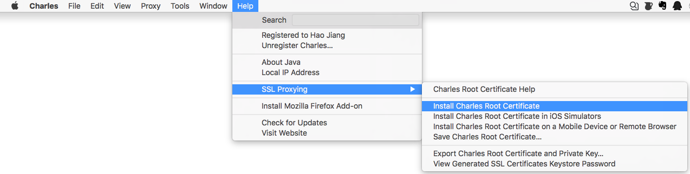
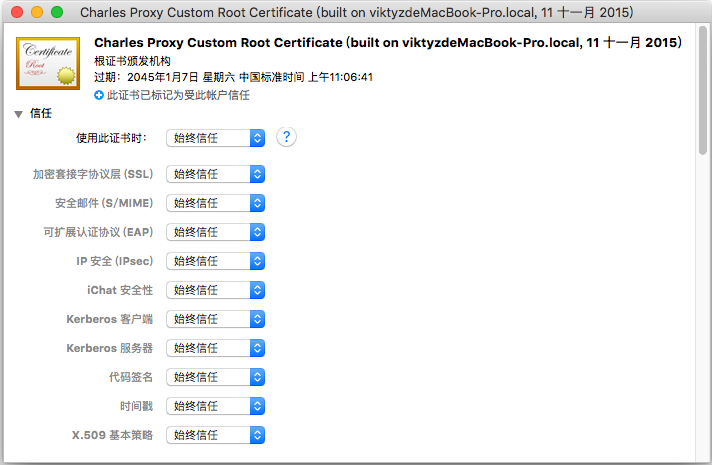
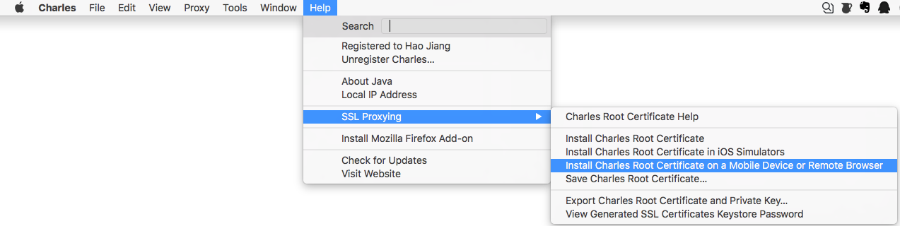
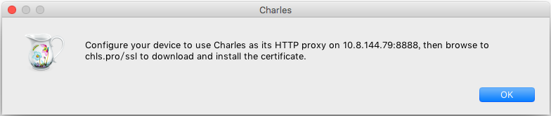
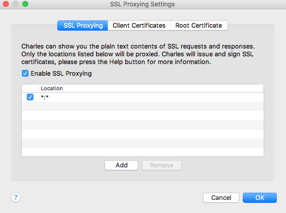
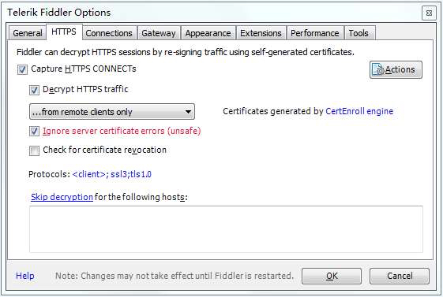
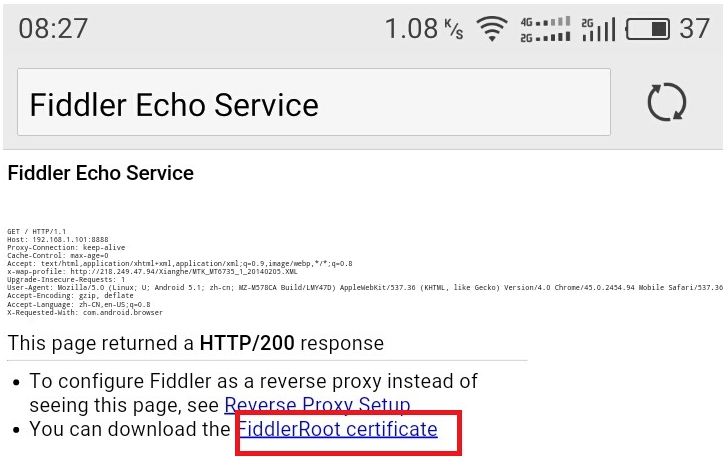

### 变更记录

| 序号 | 录入时间 | 录入人 | 备注 |
|:--------:|:--------:|:--------:|:--------:|
| 1 | 2016-12-26 | [Alfred Jiang](https://github.com/viktyz) | - |
| 1 | 2017-09-14 | [Alfred Jiang](https://github.com/viktyz) | 增加部分安卓机型和 iOS 版本安装注意 |

### 方案名称

网络 - HTTPS 网络请求真机抓包（Mac & Windows）（Fiddler & Charles）（Fiddler & Charles）

### 关键字

网络 \ 抓包 \ HTTPS \ Fiddler \ Charles

### 需求场景

1. 需要对真机进行 HTTPS 请求抓包时

### 参考链接

1. [CSDN - 使用Charles抓https请求包](http://blog.csdn.net/qq_23195583/article/details/52087189)
2. [博客园 - fiddler 抓包http和https以及android平台下抓取](http://www.cnblogs.com/xyyz/p/5824845.html)
3. [博客园 - 抓包工具Charles使用教程](http://www.cnblogs.com/yuanjunliang/articles/5167927.html)
4. [CSDN - 【HTTP】Fiddler（二） - 使用Fiddler做抓包分析](http://blog.csdn.net/ohmygirl/article/details/17849983/)

### 详细内容

#### 一、Mac 下使用 Charles 进行 HTTPS 抓包

* 安装 Mac 端证书：Mac 端打开 Charles， 顶部工具栏 -> Help -> SSL Proxying -> Install Charles Root Certificate



* 信任证书：Mac 端打开 密钥串访问（Keychain Access），左侧选择栏 -> 登陆 -> 证书 -> 双击 Charles Proxy Custom Root Certificate -> 信任 -> 使用此证书时 : 始终信任



* 安装 手机 端证书：Mac 端打开 Charles， 顶部工具栏 -> Help -> SSL Proxying -> Install Charles Root Certificate on a Mobile Device or Remote Browser -> 弹出 **安装链接（chls.pro/ssl）** -> 手机端打开浏览器并输入 **安装链接（chls.pro/ssl）** -> 下载并安装证书





注意：

##### 1. 部分安卓机型（小米、华为等）需要导出证书文件上传到手机，并进行安装

```
导出：Mac 端打开 Charles， 顶部工具栏 -> Help -> SSL Proxying -> Save Charles Root Certificate -> 通过邮件或其他数据传输方式将证书传输至手机设备

安装：手机端进入设置 -> 安全和隐私 -> 从存储设备安装
```


##### 2. iOS 10.3 之后系统，下载安装证书会有验证和信任两个步骤

```
验证：设置 -> 通用 -> 描述文件 -> 点击证书并选择验证

信任：设置 -> 通用 -> 关于本机 -> 证书信任设置 -> 打开证书信任开关
```

* 配置 Mac 端 HTTPS 抓包：Mac 端打开 Charles， 顶部工具栏 -> Proxy -> SSL Proxying Settings... -> SSL Proxying -> 勾选 Enable SSL Proxying -> 点击 Add -> Host : * -> Port : *



更多抓包功能参考：[博客园 - 抓包工具Charles使用教程](http://www.cnblogs.com/yuanjunliang/articles/5167927.html)

#### 二、Windows 下使用 Fiddler 进行 HTTPS 抓包

* 配置 Windows 端 HTTPS 抓包：Windows 端打开 Fiddler，顶部工具栏 -> Tools -> Telerik Fiddler Options -> HTTPS -> 勾选 Capture HTTPS CONNECTs -> 勾选 Decrypt HTTPS traffic -> 选择 ...from remote clients only -> 勾选 Ignore server certificate errors(unsafe)



* 安装 手机 端证书：手机端打开浏览器并输入 **代理服务器 IP 和 端口号** -> 点击最下方 FiddlerRoot certificate -> 下载并安装证书（ -> 部分设备需要选择信任操作）



* 重启 Fiddler 设备并抓包即可

更多抓包功能参考：[CSDN - 【HTTP】Fiddler（二） - 使用Fiddler做抓包分析](http://blog.csdn.net/ohmygirl/article/details/17849983/)

### 效果图
（无）

### 备注
（无）