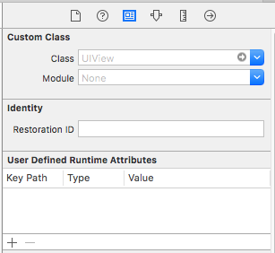
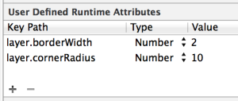
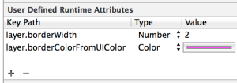
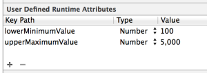

### 变更记录

| 序号 | 录入时间 | 录入人 | 备注 |
|:--------:|:--------:|:--------:|:--------:|
| 1 | 2017-02-13 | [Alfred Jiang](https://github.com/viktyz) | - |

### 方案名称

Xib - 利用 User Defined Runtime Attributes 设置运行时显示属性

### 关键字

Xib \ User Defined Runtime Attibutes \ xib 设置圆角

### 需求场景

1. 通过 xib 进行一些运行时页面显示属性设置，比如设置圆角等

### 参考链接

1. [iOS Blog - User Defined Runtime Attributes](http://www.ios-blog.co.uk/tutorials/objective-c/user-defined-runtime-attributes/)(推荐)
2. [CSDN - iOS 在user defined runtime attributes（用户定义的运行时属性）改变UI](http://blog.csdn.net/lg_sun/article/details/50519272)
3. [简书 - 在xib/storyboard里面设置view圆角半径](http://www.jianshu.com/p/1f459f0593cb)

### 详细内容

通过 Xib 设置 UIView 相关运行时页面显示属性时，可以通过 identity Inspector 下面的 User Defined Runtime Attributes 控制栏进行设置



以下是一些设置示例：

#### 示例一：设置任意指定页面边框宽度为 2px ,圆角半径 10px



代码等价于
```objectivec
    self.sampleView.layer.borderWidth = 2.0;
    self.sampleView.layer.cornerRadius = 10.0;
```

#### 示例二：设置任意指定页面边框宽度为 2px ,边框颜色为紫色



代码等价于
```objectivec
    self.sampleView.layer.borderWidth = 2.0;
    self.sampleView.layer.borderColor = [[UIColor magentaColor] CGColor];
```

#### 示例三：设置 UISlider 控件最小值 100，最大值 5000



代码等价于
```objectivec
    self.sampleSlider.minimumValue = 100;
    self.sampleSlider.maximumValue = 5000;
```

### 效果图
（无）

### 备注

* [UIView - 代码设置 UIView 的阴影、圆角、边框效果](Note_00145_20160308.md)