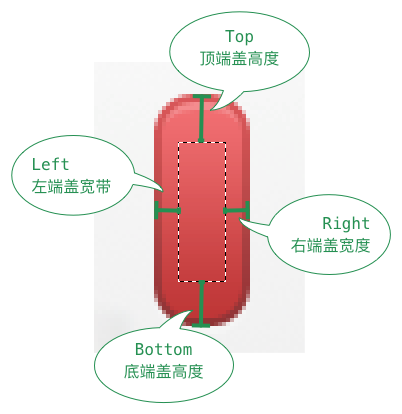
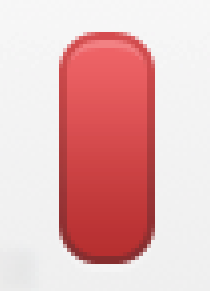
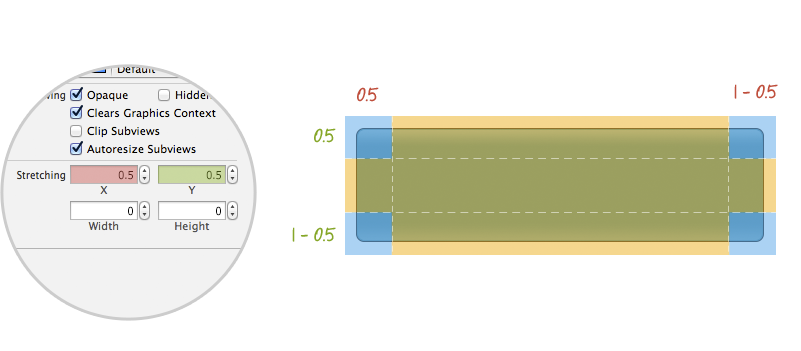
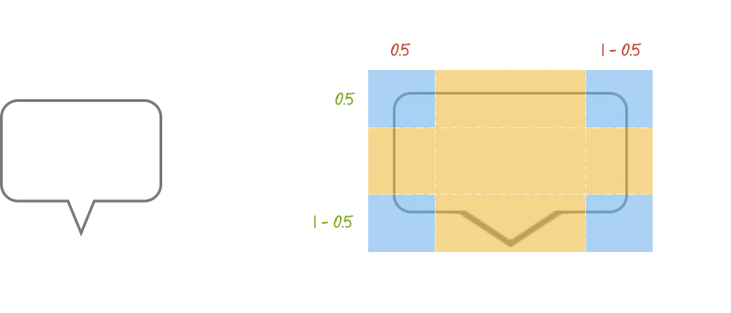
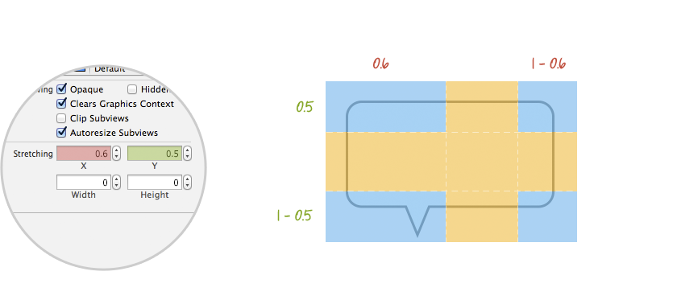

### 变更记录

| 序号 | 录入时间 | 录入人 | 备注 |
|:--------:|:--------:|:--------:|:--------:|
| 1 | 2017-02-24 | [Alfred Jiang](https://github.com/viktyz) | - |

### 方案名称

UIImageView \ UIImage - 图片拉伸技巧

### 关键字

UIImageView \ UIImage \ 图片拉伸技巧

### 需求场景

1. 需要对 UIImageView 中 UIImage 图片进行拉伸时

### 参考链接

1. [CSDN - iOS图片拉伸技巧](http://blog.csdn.net/q199109106q/article/details/8615661)(推荐)
2. [Macoscope - Stretchable Images Using Interface Builder](http://macoscope.com/blog/stretchable-images-using-interface-builder/)(推荐)

### 详细内容

#### 代码拉伸实现

本文档仅介绍 iOS 6 之后代码拉伸方法，iOS 6 之前代码拉伸方法请参考 [CSDN - iOS图片拉伸技巧](http://blog.csdn.net/q199109106q/article/details/8615661)

```objectivec
- (UIImage *)resizableImageWithCapInsets:(UIEdgeInsets)capInsets resizingMode:(UIImageResizingMode)resizingMode NS_AVAILABLE_IOS(6_0); // the interior is resized according to the resizingMode
```

UIEdgeInsets 参数通过以下四个属性确定指定区域

```
left：左端盖宽度
right：右端盖宽度
top：顶端盖高度
bottom：底端盖高度
```

对应拉伸区域与端盖位置定义



UIImageResizingMode 参数包含以下两种枚举

```
UIImageResizingModeTile：平铺模式，通过重复显示 UIEdgeInsets 指定的矩形区域来填充图片
UIImageResizingModeStretch：拉伸模式，通过拉伸 UIEdgeInsets 指定的矩形区域来填充图片
```

原图



代码拉伸示例

```objectivec
CGFloat top = 25; // 顶端盖高度  
CGFloat bottom = 25 ; // 底端盖高度  
CGFloat left = 10; // 左端盖宽度  
CGFloat right = 10; // 右端盖宽度  
UIEdgeInsets insets = UIEdgeInsetsMake(top, left, bottom, right);  
// 指定为拉伸模式，伸缩后重新赋值  
image = [image resizableImageWithCapInsets:insets resizingMode:UIImageResizingModeStretch];  
```

拉伸完成


#### Xib 拉伸实现

本文档仅介绍 iOS 6 之后 Xib 拉伸方法，iOS 6 之前 Xib 拉伸方法请参考 [Macoscope - Stretchable Images Using Interface Builder](http://macoscope.com/blog/stretchable-images-using-interface-builder/)

对于 Xib 创建的 UIImageView 中 UIImage 图片拉伸，可以通过 Xib 中 Show the Indentity inspector 标签栏下 Stretching 属性进行设置

以下示例图片均来自  [Macoscope - Stretchable Images Using Interface Builder](http://macoscope.com/blog/stretchable-images-using-interface-builder/)








### 效果图
（无）

### 备注
（无）


