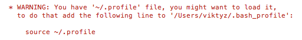

### 变更记录

| 序号 | 录入时间 | 录入人 | 备注 |
|:--------:|:--------:|:--------:|:--------:|
| 1 | 2017-04-10 | [Alfred Jiang](https://github.com/viktyz) | - |

### 方案名称

Mac 系统 - 使用 rvm 更新管理 Ruby 和 gem 版本

### 关键字

Mac 系统 \ Ruby \ gem \ rvm

### 需求场景

1. 需要更新 Mac 系统下 Ruby 和 gem 相关版本时

### 参考链接

1. [Segmentfault - 如何在Mac 终端升级ruby版本](https://segmentfault.com/a/1190000003784636)(推荐)
2. [GitHub - rvm/rvm](https://github.com/rvm/rvm)

### 详细内容

rvm 工具可以帮助实现 Mac 系统拥有多个版本的 Ruby，并且可以在多个版本之间自由切换

#### 安装 rvm

```shell
$ curl -L get.rvm.io | bash -s stable
$ source ~/.rvm/scripts/rvm
```

安装过程如果出现以下警告



可以使用[参考链接](https://github.com/rvm/rvm/issues/2832)提供的方案解决

使用以下命令检测是否安装完成，如果能显示版本号则表示安装成功

```shell
$ rvm -v
```

#### 安装 Ruby

* 列出 Ruby 可安装的版本信息

```shell
$ rvm list known
```

* 安装一个 Ruby 版本

```shell
$ rvm install 2.1.4
```

* 设置默认版本

```shell
$ rvm use 2.1.4 --default
```

* 查看已安装的 Ruby

```shell
$ rvm list
```

* 卸载一个已安装 Ruby 版本

```shell
$ rvm remove 2.1.4
```

#### 更换源

* 查看已有的源

```shell
$ gem source
```

显示如下：

```shell
CURRENT SOURCES
http://rubygems.org/
```

* 依次执行以下命令，切换至淘宝镜像服务器

```shell
$ gem update --system
$ gem uninstall rubygems-update
$ gem sources -r http://rubygems.org/
$ gem sources -a http://ruby.taobao.org
```

### 效果图
（无）

### 备注
（无）
