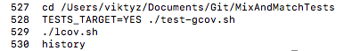
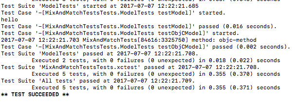
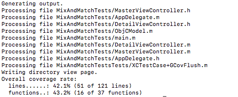
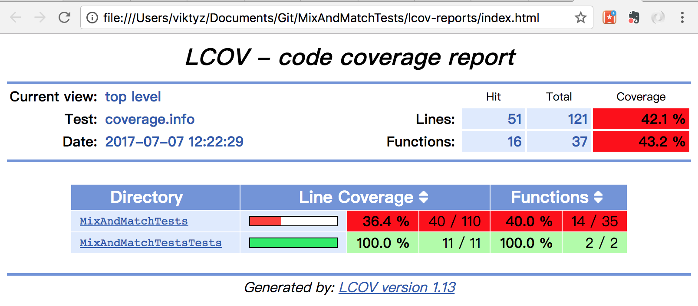

### 变更记录

| 序号 | 录入时间 | 录入人 | 备注 |
|:--------:|:--------:|:--------:|:--------:|
| 1 | 2017-07-06 | [Alfred Jiang](https://github.com/viktyz) | - |

### 方案名称

测试 - 生成测试代码覆盖率

### 关键字

测试 \ 代码覆盖率

### 需求场景

1. 生成自动化单元测试和功能测试的代码覆盖率

### 参考链接

1. [《高性能 iOS 应用开发》](https://book.douban.com/subject/27013752/)
2. [TesterHome - iOS 测试 iOS (Object-C) 非单元测试状态下代码覆盖率获取尝鲜](https://testerhome.com/topics/6644)(推荐)
3. [NSBogan - Code Coverage for iOS (Xcode 7)](http://mgrebenets.github.io/mobile%20ci/2015/09/21/code-coverage-for-ios-xcode-7)
4. [GitHub - mgrebenets/MixAndMatchTests](https://github.com/mgrebenets/MixAndMatchTests)

### 详细内容

生成代码覆盖率文件可以直接经过苹果的 LLVM 代码生成器产生，并且可以在 Xcode 中修改选项。

#### 1. 集成测试覆盖率报告


* 在 Xcode 中启用覆盖率数据收集：通过菜单进入 Product -> Scheme -> Edit Scheme，在 scheme editor 对话框中，选择左侧的 Test 项后选中 Gather coverage data，之后点击 Close 按钮保存设置。


* 运行测试用例

* 打开导航栏中的报告导航栏


* 选择最近一次运行的测试

* 打开覆盖率（Coverage）标签即可看到全部类与方法的覆盖率

* 点击对应类文件或者方法右侧小箭头可进入代码中，观察代码右侧区域，红色表示未覆盖，绿色表示已覆盖

#### 2. 外置测试覆盖率报告

关于外置测试覆盖率报告，[《高性能 iOS 应用开发》](https://book.douban.com/subject/27013752/) 中介绍的方法已经无法使用，可以参考下面的博客和 GitHub，通过 slather 来实现。

[NSBogan - Code Coverage for iOS (Xcode 7)](http://mgrebenets.github.io/mobile%20ci/2015/09/21/code-coverage-for-ios-xcode-7)

[GitHub - mgrebenets/MixAndMatchTests](https://github.com/mgrebenets/MixAndMatchTests)

在使用示例工程时务必确保正确安装 gem \ gcovr \ lcov \ bundler \ rails 等工具，详见工程 README.md。

通过 lcov.sh 输出 HTML 格式报告的命令



* 进入工程目录后执行以下命令运行测试

```shell
TESTS_TARGET=YES ./test-gcov.sh
```



* lcov.sh 输出 HTML 格式报告

```shell
./lcov.sh
```



* 打开工程目录下 MixAndMatchTests/lcov-reports/index.html 文件，可查看报告



### 效果图
（无）

### 备注
（无）


