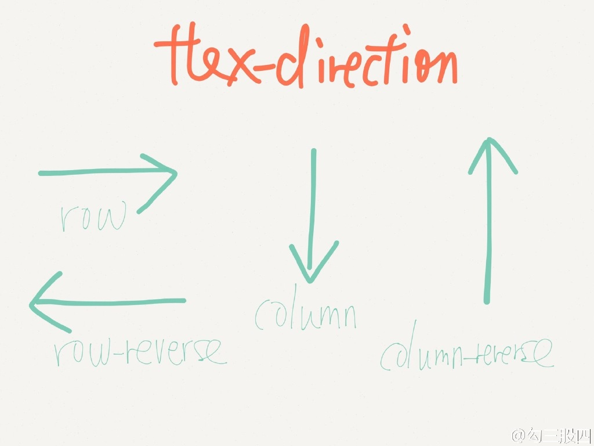
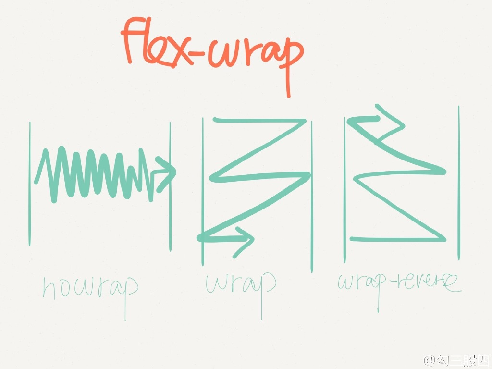
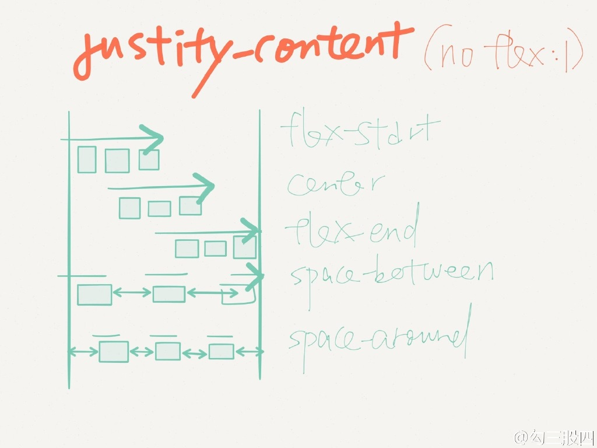
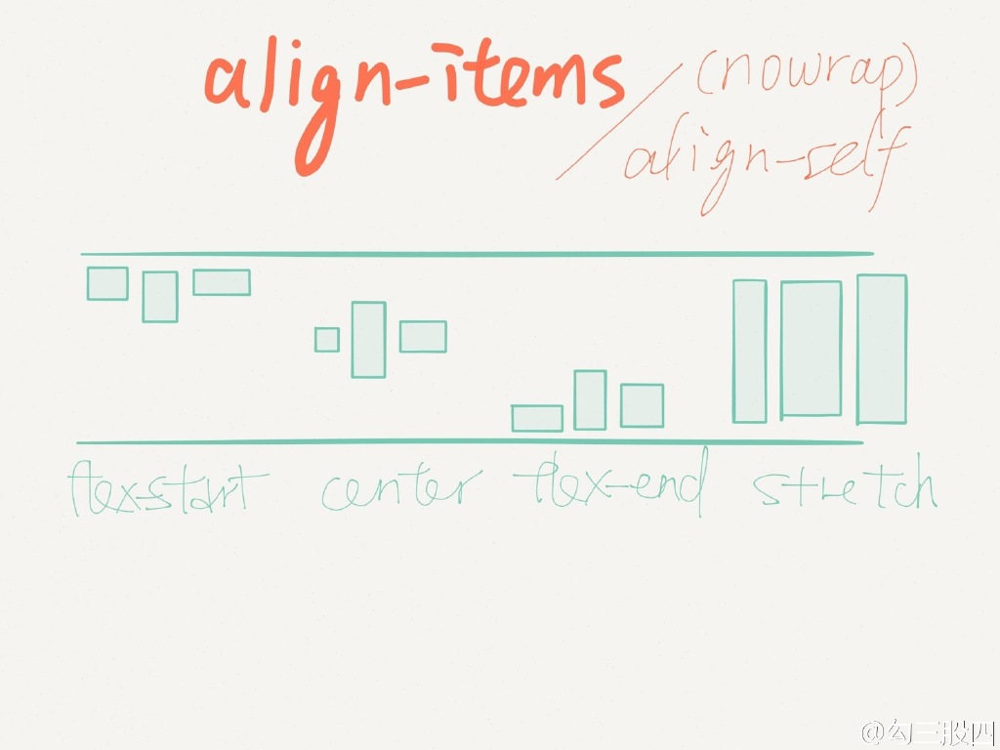
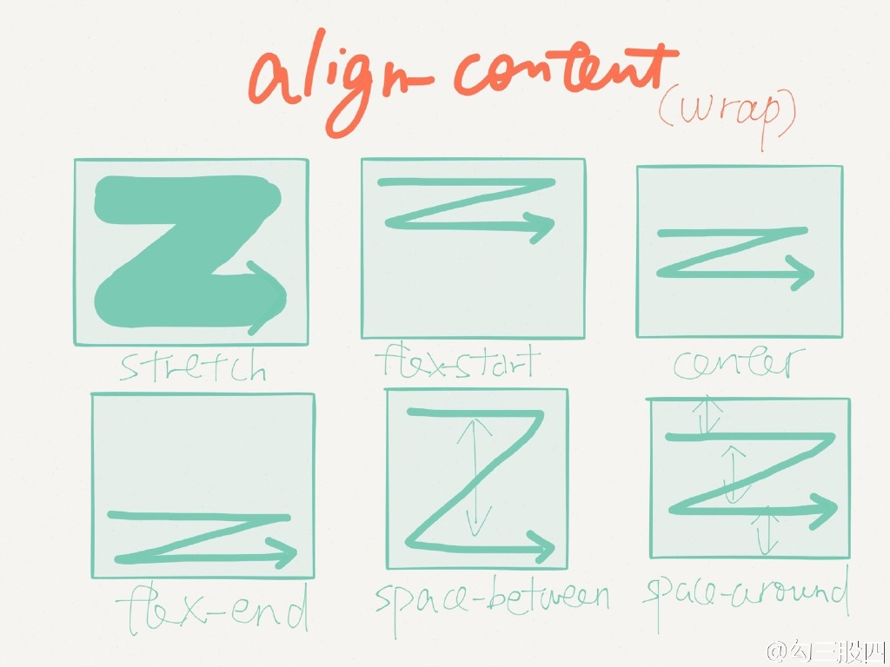

### 变更记录

| 序号 | 录入时间 | 录入人 | 备注 |
|:--------:|:--------:|:--------:|:--------:|
| 1 | 2017-12-04 | [Alfred Jiang](https://github.com/viktyz) | - |

### 方案名称

CSS - Flex 布局

### 关键字

CSS \ Flex 布局

### 需求场景

1. React Native 开发布局相关

### 参考链接

1. [阮一峰的网络日志 - Flex 布局教程：语法篇](http://www.ruanyifeng.com/blog/2015/07/flex-grammar.html)(推荐)
2. [阮一峰的网络日志 - Flex 布局教程：实例篇](http://www.ruanyifeng.com/blog/2015/07/flex-examples.html)(推荐)

### 详细内容
（见参考链接）

### 效果图
（以下图片来自微博-勾三股四整理 CSS3 Flexbox 口诀）

### 备注
（无）